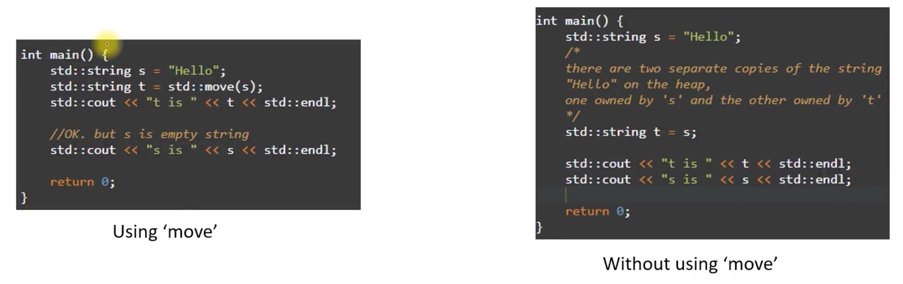
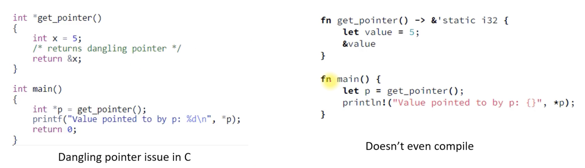

# Master The Rust Programming Language : Beginner To Advanced

- https://www.udemy.com/course/master-the-rust-programming-language/?couponCode=JUST4U02223
- https://github.com/niekiran/Rust

### 강의 자료
- Part1: [rust-part-1-Section1-Introduction-to-Section12-Enums.pdf](docs/rust-part-1-Section1-Introduction-to-Section12-Enums.pdf)
- Part2: [rust-part-2-Section13-Vectors-to-Section20-Closures.pdf](docs/rust-part-2-Section13-Vectors-to-Section20-Closures.pdf)


## Rust 공식 추천 도구

- Rust 형식(`rustfmt`): 커뮤니티에 따라 Rust 코드의 형식을 자동으로 지정
    - 프로젝트 전체의 코드가 일관된 스타일을 갖도록 보장하며 이는 특히 협업에 도움이 됨
- Rust 문법(`clippy`): 코드를 더 나은 방향으로 개선할 수 있는 린트 도구
    - Cargo Build는 내장된 정적 분석 규칙이나 린트 검사를 사용한다
    - Rust 코드를 실행하지 않고 분석하여 Rust 컴파일러 자체에서 발생하는 광범위한 문제를 찾아냄
- `cargo fix`: 코드를 자동으로 수정하는 도구
    - 코드를 수정하는 데 도움이 되는 린트 규칙을 적용하여 코드를 수정할 수 있음


#### VS CODE 에 Clippy 설치

settins.json 파일에 아래 내용 추가

```json
{
  "rust-analyzer.checkOnSave.command": "clippy",
  "rust-analyzer.checkOnSave.enable": true
}
```

## Rust Programming Language

1. Rust는 시스템 소프트웨어 작성을 위해 설계된 시스템 프로그래밍 언어입니다. 빠르고 효율적이며 신뢰할 수 있도록 개발되었습니다
2. Rust는 정적으로 유형이 지정됩니다. 이는 변수 유형이 런타임이 아닌 컴파일 타임에 알려짐을 의미합니다. 이를 통해 보다 효율적이고 예측 가능한 성능을 얻을 수 있습니다
3. Rust는 컴파일된 언어입니다. 즉, 소스 코드를 실행하려면 먼저 기계어 코드로 번역해야 합니다
4. Rust는 안전성, 동시성, 메모리 관리를 강조합니다. 소유권 및 차용 시스템을 통해 메모리 안전을 제공하므로 널 포인터 역참조 및 버퍼 오버플로와 같은 일반적인 프로그래밍 오류를 방지하는 데 도움이 됩니다


### Support for OOP

Rust는 구조(구조체)와 특성을 사용하여 객체 지향 프로그래밍(OOP)을 지원합니다    
OOP에 대한 Rust의 접근 방식은 Java나 C++와 같은 기존 OOP 언어만큼 완전히 개발되지는 않았지만 일반적인 OOP 디자인 패턴을 구현하는 데 충분한 기능을 제공합니다    
Rust의 소유권 및 차용 모델은 안전하고 예측 가능한 객체 수명을 보장하는 데 도움이 되므로 OOP 프로그래밍에 적합한 선택입니다


## Rust 는 다른 프로그래밍 언어와 어떻게 다른가요?

- `Concurrency`: Rust에는 동시성 지원 기능이 내장되어 있어 여러 스레드에서 코드를 안전하게 실행할 수 있습니다. 이는 다른 언어에서 사용되는 공유 상태 동시성과 달리 가벼운 "tasks"와 메시지 전달 동시성을 통해 달성됩니다
- `Package manager`: Rust에는 라이브러리와 패키지를 쉽게 찾고, 사용하고, 공유할 수 있게 해주는 "Cargo"라는 패키지 관리자가 내장되어 있습니다. 이를 통해 효율적인 개발 및 코드 재사용이 가능하며 강력한 커뮤니티 중심 생태계를 촉진합니다
- `Strong typing`: 즉, 변수에는 특정 유형이 있으며 해당 유형을 존중해야 합니다. 이는 컴파일러가 모든 유형 불일치에 플래그를 지정하므로 오류를 조기에 포착하는 데 도움이 되며 코드를 더욱 예측 가능하게 만듭니다
- `No runtime`: Rust에는 런타임도 없고 가비지 수집기도 없습니다. 이를 통해 프로그램에 대한 더 많은 제어가 가능하고 런타임이 필요하지 않으므로 성능이 저하되고 가비지 수집기의 복잡성이 추가됩니다
- `Error handling`: Rust는 오류 처리에 대한 독특한 접근 방식을 가지고 있어 오류를 안전하고 명시적으로 처리할 수 있습니다. Rust 에서 오류는 특정 유형으로 표시되며, 이는 프로그래머가 Result 유형 및 `?` 연산자
- `Cross-platform compatibility`: Rust는 Windows, Linux, macOS 및 심지어 임베디드 시스템을 포함한 다양한 플랫폼에서 실행되는 코드를 작성하는 데 사용될 수 있습니다.  
  따라서 웹 개발, Linux 커널 개발, 게임 개발 및 IoT를 포함한 다양한 유형의 프로젝트 및 시스템에 적합한 다용도 언어입니다


### 메모리 안전성

메모리 안전은 프로그램이 정의되지 않은 동작을 일으키지 않거나 메모리에 대한 잘못된 액세스로 인해 충돌이 발생하지 않도록 보장하는 것을 의미합니다  
Rust는 엄격한 소유권 모델, 자동 참조 계산, 한 번에 프로그램의 한 부분에서만 메모리 조각에 액세스할 수 있도록 보장하는 빌림 검사기, `null`과 같은 일반적인 프로그래밍 오류 방지, 데이터 경합 및 매달린
포인터 참조 등의 기능을 결합하여 이를 달성합니다

#### Rust는 자동으로 힙 메모리 할당을 해제합니다

- Rust에서는 일반적으로 C++에서처럼 `new` 및 `free`와 같은 함수를 사용하여 힙 메모리를 수동으로 관리하지 않습니다
- Rust는 소유권 시스템을 통해 메모리 관리를 자동화합니다. 각 데이터 조각에는 명확하고 컴파일 시간에 정의된 소유자가 있으며, 소유자가 범위를 벗어나면 메모리 할당이 자동으로 해제됩니다

### Ownership model

- Rust 에서 소유권은 Rust 컴파일러가 메모리에 있는 값의 수명을 관리하는 방식을 나타냅니다. 소유권 규칙에 따르면 값에는 소유자가 한 명만 있을 수 있으며 소유자가 범위를 벗어나면 값이 자동으로 삭제됩니다
- 이러한 규칙을 시행함으로써 Rust는 데이터 경합 및 기타 일반적인 프로그래밍 오류를 방지하여 시스템 프로그래밍을 위한 안전하고 효율적인 언어로 만듭니다

### 동등한 C++ 코드



- Rust 에서 `String`의 소유권을 한 변수에서 다른 변수로 이전하는 것은 명시적인 `std::move`가 필요 없이 기본적으로 자동으로 발생합니다
- Rust 에서는 소유권 이전 후 원래 `String`이 더 이상 유효하지 않으며, 이를 사용하려고 하면 컴파일 타임 오류가 발생합니다

### Rust는 매달린 포인터를 피합니다



- 코드는 경고 `Wreturn-local-addr`과 함께 컴파일됩니다
- 'p'에는 유효하지 않은 주소가 있습니다
- 'p'를 역참조하면 원하지 않는 동작이나 충돌이 발생합니다

### Type inference

Rust 에는 `Type inference` 기능이 있습니다    
즉, 컴파일러는 명시적으로 지정할 필요 없이 변수나 표현식의 유형을 자동으로 추론할 수 있습니다    
이렇게 하면 코드를 더 읽기 쉽고 덜 장황하게 만들 수 있습니다

```
let x = 42; // The type of `x` is inferred to be `i32`
int x = 42; // The type of `x` is explicitly set to `int`
```

### Error handling

- Rust는 C++와 같은 예외 대신 반환 값 기반 오류 처리를 사용합니다
- Rust에서 오류는 일반적으로 `Result` 및 `Option` 유형으로 표시되어 함수에서 성공, 오류 또는 값 없음 조건을 반환합니다
- Rust 프로그래밍 언어는 정의되지 않은 동작을 방지하기 위해 명시적인 오류 처리 및 컴파일 타임 검사를 사용하는 반면 C++는 예외에 의존합니다


## Rust 자료형에 대응하는 Java 자료형

| **Rust 자료형**    | **Java 자료형**                       |
|-----------------|------------------------------------|
| `i8`            | `byte`                             |
| `i16`           | `short`                            |
| `i32`           | `int`                              |
| `i64`           | `long`                             |
| `i128`          | `BigInteger`                       |
| `isize`         | `int` (32-bit) 또는 `long` (64-bit)  |
| `u8`            | `short` (부호 없는 정수형은 Java에 없음)      |
| `u16`           | `int` (부호 없는 정수형은 Java에 없음)        |
| `u32`           | `long` (부호 없는 정수형은 Java에 없음)       |
| `u64`           | `BigInteger` (부호 없는 정수형은 Java에 없음) |
| `usize`         | `int` (32-bit) 또는 `long` (64-bit)  |
| `f32`           | `float`                            |
| `f64`           | `double`                           |
| `bool`          | `boolean`                          |
| `char`          | `char`                             |
| `&str`          | `String`                           |
| `String`        | `String`                           |
| `[T; N]`        | `T[]`                              |
| `(T1, T2, ...)` | `class` (사용자 정의 클래스)               |


## Rust 문서 모음

- 러스트 북 커뮤니티 번역본: https://doc.rust-kr.org/
  - GitHub: https://github.com/rust-kr/doc.rust-kr.org/blob/master/src/ch10-00-generics.md
- 러스트 북 원본 영문: https://doc.rust-lang.org/stable/book/
- 러스트 북 Summary: https://codeahoy.com/learn/tutorials/rust-book-summary/
- 러스트 북 Example Solutions
  - https://github.com/kmoschcau/rust-book-exercises
  - https://github.com/olehmisar/The-Rust-Programming-Language-Book-Solutions
  - https://github.com/laercioxlaercio/rust
  - https://github.com/kevinalh/rust-book
  - https://github.com/klemola/rust-book
  - https://github.com/jasonkuhrt-archive/rust-book-exercises
  - https://github.com/Lukman-01/rust-learn-by-practice
  - https://github.com/rust-unofficial/rust-practise-questions/tree/master/src
- 러스트 프로그래밍 공식 가이드 스터디: https://github.com/karais89/rust-the-book
- 러스트 북 Quiz 버전: https://rust-book.cs.brown.edu/
- 표준 라이브러리 문서: https://www.rust-lang.org/learn
- Rust API Document: https://doc.rust-lang.org/std/
- Rust Project: https://www.rust-lang.org/
- Rust Document: https://doc.rust-lang.org/
  - Rust Reference: https://doc.rust-lang.org/reference/introduction.html
  - The Edition Guide: https://doc.rust-lang.org/edition-guide/editions/index.html
  - The Release Notes: https://doc.rust-lang.org/releases.html
  - The rustc Book: https://doc.rust-lang.org/rustc/
  - The Cargo Book: https://doc.rust-lang.org/beta/cargo/index.html
  - The Rustdoc Book: https://doc.rust-lang.org/beta/rustdoc/index.html
  - The Clippy Book: https://doc.rust-lang.org/beta/clippy/index.html
  - rustc error codes: https://doc.rust-lang.org/beta/error_codes/index.html
  - The Style Guide: https://doc.rust-lang.org/beta/style-guide/index.html
  - The Rustonomicon: https://doc.rust-lang.org/beta/nomicon/index.html
  - The Unstable Book: https://doc.rust-lang.org/beta/unstable-book/index.html
  - Rust Compiler Developer Guide: https://rustc-dev-guide.rust-lang.org/
  - Rust Embedded: https://github.com/rust-embedded
  - The Embedded Rust Book: https://doc.rust-lang.org/beta/embedded-book/index.html
- Rust Docs 검색: https://docs.rs/
- Rust Playground: https://play.rust-lang.org/?version=stable&mode=debug&edition=2021
  - https://github.imc.re/topics/rustlings-solution?o=asc&s=stars
- Comprehensive Rust book(Google Android 팀 제작): https://google.github.io/comprehensive-rust/ko/index.html
  - GitHub: https://github.com/google/comprehensive-rust
- 러스트 관련 링크 모음: https://github.com/YoungHaKim7/Rust_BackEnd_Web_Dev
- Learning Rust: https://gist.github.com/noxasaxon/7bf5ebf930e281529161e51cd221cf8a

## Rust 무료 전자책

- Effective Rust
  - https://effective-rust.com/title-page.html
- The Little Book of Rust Macros
  - https://danielkeep.github.io/tlborm/book/index.html
- Rust Atomics and Locks
  - https://marabos.nl/atomics/foreword.html
- Rust Design Patterns
  - https://rust-unofficial.github.io/patterns/
- Learn Rust 101
  - https://rust-lang.guide/intro/index.html
- A Gentle Introduction To Rust
  - https://stevedonovan.github.io/rust-gentle-intro/
- Easy Rust
  - https://dhghomon.github.io/easy_rust/

## Rust Example
- Rust 예제: https://doc.rust-lang.org/rust-by-example/
- Rust 예제 & 해답: https://github.com/rust-lang/rustlings
- Rust By Practice: https://practice.course.rs/why-exercise.html
- 100 Exercises To Learn Rust: https://rust-exercises.com/100-exercises/

- 궁극의 러스트
  - https://github.com/CleanCut/ultimate_rust_crash_course
  - https://github.com/CleanCut/ultimate_rust2
  - https://github.com/CleanCut/rusty_engine


## Rust 국내출간도서 예제코드 모음

- 러스트 프로페셔널 코드(제이펍) - 동시성, 성능 최적화, 디자인 패턴 등 러스트 전문가가 되기 위한 모든 것
  - https://github.com/brndnmtthws/code-like-a-pro-in-rust-book
- 커맨드라인 러스트(제이펍) - `cat`,`grep`,`ls`등 14가지 유용한 CLI 도구를 클론 코딩하며 배우는 러스트 활용
  - https://github.com/chosungmann/command-line-rust-examples
- 러스트 서버, 서비스, 앱, 만들기(제이펍) - 백엔드 서버, 서비스, 프런트엔드 모두 러스트로 안전하고 빠르게 구축하기
  - https://github.com/moseskim/rust-servers-services-apps
- 제로부터 시작하는 러스트 백엔드 프로그래밍(제이펍) - 뉴스레터 API를 만들며 배우는 러스트 A to Z
  - https://github.com/LukeMathWalker/zero-to-production
- 프로그래밍 러스트(제이펍) - 빠르고 안전한 시스템 개발 개정2판
  - https://github.com/chosungmann/programming-rust-2nd-edition-examples
- 파이썬과 비교하며 배우는 러스트 프로그래밍
  - https://indosaram.github.io/rust-python-book/ch1-00.html
- Code from for Refactoring to Rust
  - https://github.com/Indosaram/rust-python-book
- 러스트 동시성 프로그래밍(한빛미디어) - Atomic과 Lock으로 안전하고 효율적인 동시성 코드 작성하기
  - https://marabos.nl/atomics
- 러스트 웹 개발(길벗) - Tokio, Warp, Reqwest를 활용한 웹 애플리케이션 개발!
  - https://github.com/gilbutITbook/080350
- 러스트 프로그래밍(인사이트) - 러스트 언어의 기초부터 실전까지
  - https://github.com/rust-in-action/code
- 만들면서 배우는 러스트 프로그래밍(위키북스) - 다양한 예제로 쉽게 익히고 널리 활용하는 고효율 언어 Rust 실전 가이드
  - https://github.com/wikibook/rust
- Rust Crash Course
  - https://github.com/bpbpublications/Rust-Crash-Course
- Write Powerful Rust Macros
  - https://github.com/GlenDC/write-powerful-rust-macros/
- Idiomatic Rust: Code like a Rustacean source code (Rust Design Patterns)
  - https://github.com/brndnmtthws/idiomatic-rust-book
- Rust Web Programming - Second Edition
  - https://github.com/PacktPublishing/Rust-Web-Programming-2nd-Edition
- Refactoring to Rust
  - https://github.com/lily-mara/refactoring-to-rust
- Black Hat Rust
  - https://github.com/skerkour/black-hat-rust
- Dark Web Rust
  - https://github.com/wiseaidev/dark-web-rust
- Rust Systems Programming
  - https://github.com/alfredodeza/rust-systems-programming
- Ultimate Rust for Systems Programming
  - https://github.com/OrangeAVA/Ultimate-Rust-for-Systems-Programming
- Beginning Rust: From Novice to Professional
  - https://github.com/Apress/beginning-rust-2e
- Hands-on Rust
  - https://github.com/thebracket/HandsOnRust

### Rust Old

- Creative Projects for Rust Programmers
  - https://github.com/PacktPublishing/Creative-Projects-for-Rust-Programmers
- Practical Machine Learning with Rust: Creating Intelligent Applications in Rust
  - https://github.com/Apress/practical-machine-learning-w-rust
- Programming-WebAssembly-With-Rust-Sources
  - https://github.com/liborui/Programming-WebAssembly-With-Rust-Sources
- The Complete Rust Programming Reference Guide
  - https://github.com/PacktPublishing/The-Complete-Rust-Programming-Reference-Guide
- Hands-On Data Structures and Algorithms with Rust
  - https://github.com/PacktPublishing/Hands-On-Data-Structures-and-Algorithms-with-Rust
- Hands-On Microservices with Rust 2018: How To Build Scalable and Reliable RESTful Microservices
  - https://github.com/PacktPublishing/Hands-On-Microservices-with-Rust
- Rust High Performance
  - https://github.com/PacktPublishing/Rust-High-Performance
- Hands-On Functional Programming in Rust
  - https://github.com/PacktPublishing/Hands-On-Functional-Programming-in-Rust
- Hands-On Concurrency with Rust
  - https://github.com/PacktPublishing/Hands-On-Concurrency-with-Rust
- Rust Essentials - Second Edition
  - https://github.com/PacktPublishing/Rust-Essentials-Second-Edition
- Mastering Rust - Second Edition
  - https://github.com/PacktPublishing/Mastering-RUST-Second-Edition
- Rust Quick Start Guide
  - https://github.com/PacktPublishing/Rust-Quick-Start-Guide
- Rust Programming By Example: Enter the world of Rust by building engaging, concurrent, reactive, and robust applications
  - https://github.com/PacktPublishing/Rust-Programming-By-Example
- Network Programming with Rust
  - https://github.com/PacktPublishing/Network-Programming-with-Rust
- Rust Standard Library Cookbook
  - https://github.com/PacktPublishing/Rust-Standard-Library-Cookbook
- Rust Cookbook
  - https://github.com/PacktPublishing/Rust-Cookbook
- Rust Programming Cookbook
  - https://github.com/PacktPublishing/Rust-Programming-Cookbook

## Rust 라이브러리 모음

- flapigen(jni 변환): https://github.com/Dushistov/flapigen-rs
- Awesome Rust(각종 Rust 인기 라이브러리 모음): https://github.com/rust-unofficial/awesome-rust  