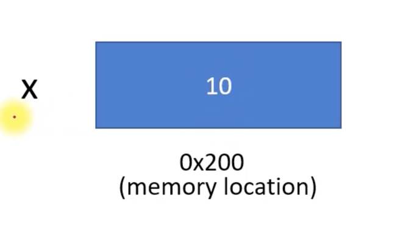

# Rust 는 다른 프로그래밍 언어와 어떻게 다른가요?

## 메모리 안전성

메모리 안전은 프로그램이 정의되지 않은 동작을 일으키지 않거나 메모리에 대한 잘못된 액세스로 인해 충돌이 발생하지 않도록 보장하는 것을 의미합니다  
Rust는 엄격한 소유권 모델, 자동 참조 계산, 한 번에 프로그램의 한 부분에서만 메모리 조각에 액세스할 수 있도록 보장하는 빌림 검사기, `null`과 같은 일반적인 프로그래밍 오류 방지, 데이터 경합 및 매달린 포인터 참조 등의 기능을 결합하여 이를 달성합니다

https://play.rust-lang.org/?version=stable&mode=debug&edition=2021

