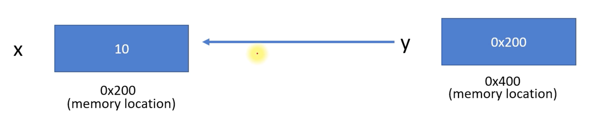
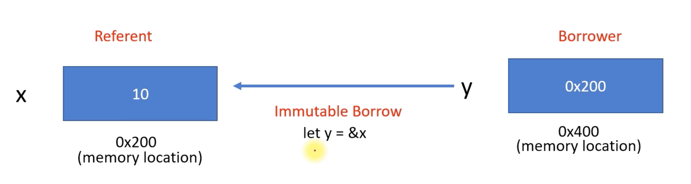

# Borrowing

```rust
fn main() {
    let mut x = 10;
    let y = &x;  // int *p = &x
    println!("{}", x);
}
```




```rust
fn main() {
    let mut x = 10;
    let y = &x;  // int *p = &x
    x = 15;       // x = 15
    println!("{}", *y); // printf(&y) 
}
```




```rust
fn main() {
    let mut x = 10;
    let y = &mut x;  // int *y = &x
    *y = 15;       // *y = 15
    println!("{}", x); 
}
```