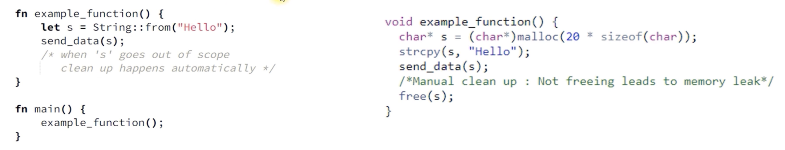

# Rust는 자동으로 힙 메모리 할당을 해제합니다

- Rust에서는 일반적으로 C++에서처럼 `new` 및 `free`와 같은 함수를 사용하여 힙 메모리를 수동으로 관리하지 않습니다
- Rust는 소유권 시스템을 통해 메모리 관리를 자동화합니다. 각 데이터 조각에는 명확하고 컴파일 시간에 정의된 소유자가 있으며, 소유자가 범위를 벗어나면 메모리 할당이 자동으로 해제됩니다

## 변수가 범위를 벗어날 때 C 와 Rust 의 메모리 정리 비교

두 경우 모두 "Hello"라는 문자열이 힙에 저장됩니다. Rust 는 drop 메소드를 사용하여 메모리를 정리합니다