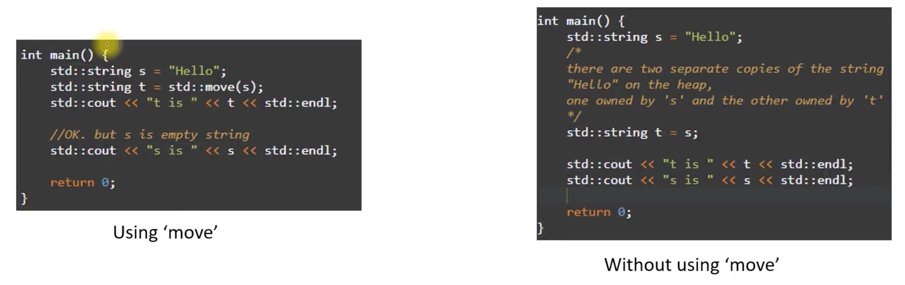

# Rust는 다른 프로그래밍 언어와 어떻게 다른가요?

## Ownership model

- Rust 에서 소유권은 Rust 컴파일러가 메모리에 있는 값의 수명을 관리하는 방식을 나타냅니다. 소유권 규칙에 따르면 값에는 소유자가 한 명만 있을 수 있으며 소유자가 범위를 벗어나면 값이 자동으로 삭제됩니다
- 이러한 규칙을 시행함으로써 Rust는 데이터 경합 및 기타 일반적인 프로그래밍 오류를 방지하여 시스템 프로그래밍을 위한 안전하고 효율적인 언어로 만듭니다


Rust 에서 Rust 의 소유권에 대한 간단한 예

```rust
fn main() {
    let s = String::from("hello");
    let t = s;
    println!("t is {}", t);
    // println!("s is {}", s); // Error: s has moved to t
}
```

1. **C/C++** 에서 정의되지 않은 동작인 double free 문제를 방지합니다
2. 무료 이후에는 사용을 자제합니다
3. 데이터 경쟁 방지
4. 힙 메모리의 효율적인 사용. "Hello" 데이터의 복사본이 두 개 없습니다. `clone()` 메소드를 사용하여 명시적으로 요청된 데이터 복사본
5. 코드를 더 예측 가능하게 만들고 메모리 오류가 발생할 가능성을 줄입니다


## 동등한 C++ 코드 



- Rust 에서 `String`의 소유권을 한 변수에서 다른 변수로 이전하는 것은 명시적인 `std::move`가 필요 없이 기본적으로 자동으로 발생합니다
- Rust 에서는 소유권 이전 후 원래 `String`이 더 이상 유효하지 않으며, 이를 사용하려고 하면 컴파일 타임 오류가 발생합니다


```rust
fn fun1() {
    let mut s = String::from("Hello");
    let t = String::from("World");
    /*
        't' 소유권이 's'로 이동했습니다
        's'가 가리키는 메모리는 정리되고 't'는 초기화되지 않습니다 
     */
    s = t;
    // println!("t is {}", t); // 오류: 't'는 이제 더 이상 유효하지 않습니다.
    
    /* print "s is world" */
    println!("s is {}", s);

    /* Error: 다시 초기화하지 않으면 't'를 사용할 수 없습니다 */
    // println!("t is {}", t);
}

fn main() {
    fun1();
}
```

## Rust는 매달린 포인터를 피합니다


- 코드는 경고 `Wreturn-local-addr`과 함께 컴파일됩니다
- 'p'에는 유효하지 않은 주소가 있습니다
- 'p'를 역참조하면 원하지 않는 동작이나 충돌이 발생합니다


## Type inference

Rust 에는 `Type inference` 기능이 있습니다    
즉, 컴파일러는 명시적으로 지정할 필요 없이 변수나 표현식의 유형을 자동으로 추론할 수 있습니다    
이렇게 하면 코드를 더 읽기 쉽고 덜 장황하게 만들 수 있습니다

```
let x = 42; // The type of `x` is inferred to be `i32`
int x = 42; // The type of `x` is explicitly set to `int`
```


## Rust는 다른 프로그래밍 언어와 어떻게 다른가요?

- `Concurrency`: Rust에는 동시성 지원 기능이 내장되어 있어 여러 스레드에서 코드를 안전하게 실행할 수 있습니다. 이는 다른 언어에서 사용되는 공유 상태 동시성과 달리 가벼운 "tasks"와 메시지 전달 동시성을 통해 달성됩니다
- `Package manager`: Rust에는 라이브러리와 패키지를 쉽게 찾고, 사용하고, 공유할 수 있게 해주는 "Cargo"라는 패키지 관리자가 내장되어 있습니다. 이를 통해 효율적인 개발 및 코드 재사용이 가능하며 강력한 커뮤니티 중심 생태계를 촉진합니다
- `Strong typing`: 즉, 변수에는 특정 유형이 있으며 해당 유형을 존중해야 합니다. 이는 컴파일러가 모든 유형 불일치에 플래그를 지정하므로 오류를 조기에 포착하는 데 도움이 되며 코드를 더욱 예측 가능하게 만듭니다
- `No runtime`: Rust에는 런타임도 없고 가비지 수집기도 없습니다. 이를 통해 프로그램에 대한 더 많은 제어가 가능하고 런타임이 필요하지 않으므로 성능이 저하되고 가비지 수집기의 복잡성이 추가됩니다
- `Error handling`: Rust는 오류 처리에 대한 독특한 접근 방식을 가지고 있어 오류를 안전하고 명시적으로 처리할 수 있습니다. Rust 에서 오류는 특정 유형으로 표시되며, 이는 프로그래머가 Result 유형 및 `?` 연산자
- `Cross-platform compatibility`: Rust는 Windows, Linux, macOS 및 심지어 임베디드 시스템을 포함한 다양한 플랫폼에서 실행되는 코드를 작성하는 데 사용될 수 있습니다. 따라서 웹 개발, Linux 커널 개발, 게임 개발 및 IoT를 포함한 다양한 유형의 프로젝트 및 시스템에 적합한 다용도 언어입니다

## Error handling

- Rust는 C++와 같은 예외 대신 반환 값 기반 오류 처리를 사용합니다
- Rust에서 오류는 일반적으로 `Result` 및 `Option` 유형으로 표시되어 함수에서 성공, 오류 또는 값 없음 조건을 반환합니다
- Rust 프로그래밍 언어는 정의되지 않은 동작을 방지하기 위해 명시적인 오류 처리 및 컴파일 타임 검사를 사용하는 반면 C++는 예외에 의존합니다


### Rust uses return value based error handling

```rust
use std::fs::File;

fn main() {
    match File::open("file.txt") {
        Ok(_file) => {
            // File open success
            // Do something with the file
        },
        Err(error) => {
            // Handle the error
            println!("Error opening file: {:?}", error);
        },
    }
}
```

Rust에서는 열거형 'Result' 유형이 오류를 처리하는 데 사용됩니다. 다음은 Rust에서 파일을 열고 발생할 수 있는 오류를 처리하는 방법에 대한 예입니다

이 예에서는 `File::open` 함수를 사용하여 파일을 엽니다. 이 함수는 두 가지 가능한 값을 가질 수 있는 `Result<File, Error>`를 반환합니다. 파일이 성공적으로 열렸고 파일 핸들을 포함하는 경우 `Ok`, 오류가 발생하고 오류 값을 포함하는 경우 `Err`입니다

`match` 문은 `File::open` 함수의 결과를 확인하고 그에 따라 오류를 처리하는 데 사용됩니다


## Rust의 반환 값을 기반으로 한 오류 처리가 C++보다 임베디드 소프트웨어 사용 사례에 더 좋습니까?

임베디드 시스템에서 C++ 예외 처리를 사용하는 데에는 몇 가지 문제가 있습니다

- `Overhead`: C++ 예외는 시스템의 메모리 및 처리 리소스에 추가 오버헤드를 추가합니다. 이는 시스템의 메모리가 부족하거나 속도가 느려질 수 있으므로 리소스가 제한된 시스템에서는 문제가 될 수 있습니다
- `Unexpected behavior`: C++ 예외는 제대로 처리되지 않으면 예상치 못한 동작을 일으키거나 심지어 시스템 오류를 일으킬 수도 있습니다. 이로 인해 충돌이나 예상치 못한 시스템 동작이 발생할 수 있으며, 이는 추적 및 수정이 어렵습니다
- `Non-deterministic behavior`: C++ 예외는 실시간 임베디드 시스템에 적합하지 않은 비결정적 동작을 유발할 수 있습니다. 예외는 프로그램의 정상적인 흐름을 방해하고 프로그램이 어떻게 실행될지 예측하기 어렵게 만듭니다
- `Reduced value-based approach`: C++ 예외는 간접적인 수준을 추가하므로 Rust의 반환 값 성능 접근 방식보다 효율성이 떨어질 수 있습니다