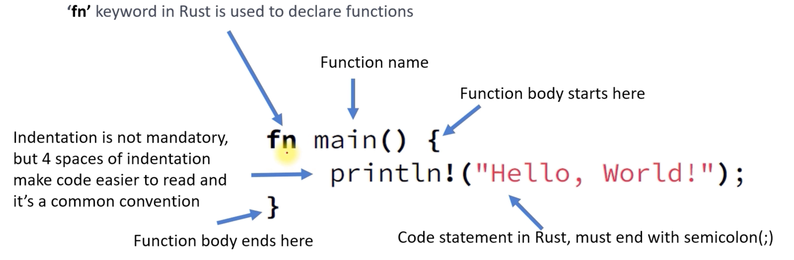

## 간단한 Hello World Rust 프로그램을 생성, 빌드 및 테스트합니다

### 1. Rust 프로그래밍 언어를 설치

공식 웹사이트 https://www.rust-lang.org/tools/install 에서 설치 프로그램을 다운로드하여 Rust 프로그래밍 언어를 설치합니다. 컴퓨터에서 실행해보세요

- https://www.rust-lang.org/
- https://www.rust-lang.org/tools/install

### 2. 터미널이나 명령 프롬프트를 열고 새 작업 공간을 만듭니다

```shell
mkdir rust_project
cd rust_project
```

## Cargo: The package manager for Rust

다른 프로그래밍 언어에도 유사한 패키지 관리자가 있습니다

- (Node Package Manager) for JavaScript
- pip for Python,
- gem for Ruby, etc

`Cargo`를 사용하면 프로젝트의 종속성을 관리하고, 코드를 컴파일 및 빌드하고, 소프트웨어를 배포 및 게시할 수 있습니다


## 3. 명령을 실행하여 새 Rust 프로젝트를 초기화합니다

```shell
cargo new hello_world_001
```

이 명령은 "hello_world_001"이라는 이름의 새 화물 프로젝트를 생성합니다  

"main.rs"는 `Cargo`가 관리하는 Rust 프로젝트의 binary crate 로 간주될 수 있습니다

Binary crate 는 프로그램의 진입점 역할을 하는 'main' 함수를 포함하는 실행 가능한 crates 입니다


### 4. 파일을 텍스트 편집기에서 엽니다

새로 생성된 "main.rs"(Rust 소스 파일) 파일을 텍스트 편집기에서 엽니다    
이 파일에는 프로그램의 진입점인 main 함수가 포함됩니다   
main.rs에 아래 코드를 넣으세요  


```rust
fn main() {
    println!("Hello, world!");
}
```


들여쓰기는 필수는 아니지만 4개의 들여쓰기를 사용하면 코드를 더 쉽게 읽을 수 있으며 이는 일반적인 규칙입니다




- 프로그램의 진입점인 'main' 함수 정의. 여기서 프로그램이 실행되기 시작합니다
- `println!("Hello, World!");`는 문자열 `"Hello, World!"`를 콘솔에 인쇄하는 Rust 매크로입니다. `println!` 매크로는 다른 프로그래밍 언어의 인쇄 기능과 유사하지만 끝에 새 줄을 추가합니다


### 5. 프로그램 빌드 및 실행

```shell
cargo build
cargo run
```

또한 `cargo build --release` 명령을 사용하여 프로그램의 릴리스 빌드를 생성할 수도 있습니다. 이렇게 하면 프로그램의 성능이 최적화되고 배포 준비가 완료됩니다
