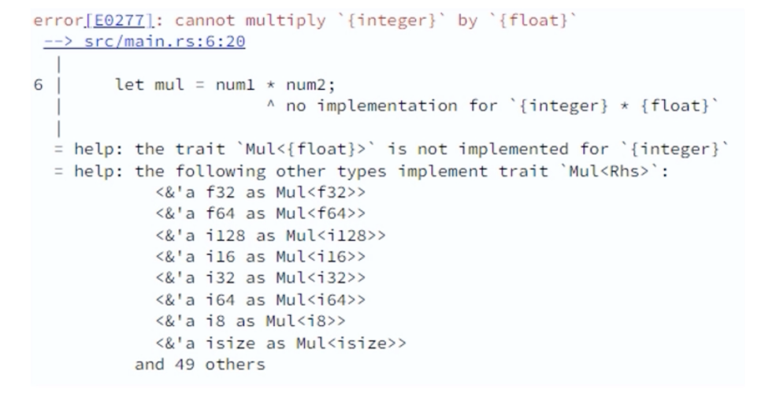

# Variables, Data types and Mutability

* 데이터 유형
* 변수 선언 방법
* Rust의 유형 추론 기능
* 유효한 변수 이름 작성 규칙
* 변수 명명 규칙

## Data types (Primitive)

Primitive types in Rust:

- Integer types: `i8`, `i16`, `i32`, `i64`, `isize`, `u8`, `u16`, `u32`, `u64`, `usize`
- Floating-point numbers: `f32`, `f64`
- Boolean: `bool`
- Character: `char`
- Arrays: `[T; N]`, where T is the type of elements and N is the number of elements.
- Slices: `&[T]`

`slice`는 각 요소가 서로 다른 유형을 가질 수 있는 고정 길이 요소 모음입니다. 이는 쉼표로 구분된 유형 목록(T1,T2,T3,...)을 묶는 괄호 세트로 정의됩니다


## Rust numerical types

| Type  | Size (bytes)                        | Range                               |
|-------|-------------------------------------|-------------------------------------|
| i8    | 1                                   | -128 to 127                         |
| i16   | 2                                   | -32768 to 32767                     |
| i32   | 4                                   | -2147483648 to 2147483647           |
| i64   | 8                                   | -9223372036854775808 to 9223372036854775807 |
| isize | platform dependent (usually 4 or 8) | platform dependent            |
| u8    | 1                                   | 0 to 255                            |
| u16   | 2                                   | 0 to 65535                          |
| u32   | 4                                   | 0 to 4294967295                     |
| u64   | 8                                   | 0 to 18446744073709551615           |
| usize | platform dependent (usually 4 or 8) | platform dependent            |
| f32   | 4                                   | -3.4 * 10^38 to 3.4 * 10^38         |
| f64   | 8                                   | -1.8 * 10^308 to 1.8 * 10^308       |


`isize` 및 `usize` 유형은 플랫폼에 따라 다르며 해당 크기는 32비트 플랫폼에서는 4바이트이고 64비트 플랫폼에서는 8바이트입니다

`i128` 및 `u128` 유형은 버전 1.26에서 도입되었으며 각각 128비트 부호 있는 정수와 부호 없는 정수를 나타내기 위한 것입니다


## Variable definition(immutable)

Syntax:  
Rust에서 변수는 `let` 키워드를 사용하여 정의되며, 그 뒤에 변수 이름과 등호, 그리고 변수에 할당하려는 값이 옵니다. Rust에서 변수를 정의하는 기본 구문은 다음과 같습니다

```
let variable_name = value; /* No type is mentioned */

let variable_name: type = value; /* Type is explicitly spelled out */

let variable_name; /* Delayed initialization */
variable_name = value;
```

변수의 `type`을 지정하려면 콜론(`:`)을 사용하고 변수 이름 뒤에 `type`을 입력하면 됩니다

```rust
fn main() {
    let value: u16 = 0;
    let sum = 10 + value;
    println!("{}", sum);
}
```

## Type inference

- 변수나 표현식이 사용되는 컨텍스트(값 할당, 함수 호출 등)에 따라 컴파일러가 해당 변수나 표현식의 유형을 자동으로 결정하도록 하는 기능입니다
- 유형 추론이 항상 가능한 것은 아니며 어떤 경우에는 프로그래머가 유형을 명시적으로 지정해야 한다는 점은 주목할 가치가 있습니다  
  예를 들어 일반 유형을 사용하거나 변수가 변경 가능한 경우입니다


Rust 에서는 변수를 선언할 때 변수의 유형을 명시적으로 지정할 필요가 없다는 점에 주목할 가치가 있습니다  
Rust 컴파일러는 할당되는 값을 기반으로 유형을 추론할 수 있습니다

Rust 컴파일러는 이러한 변수의 유형을 정수이므로 `i32`로 추론합니다  
num1과 num2는 모두 `i32` 유형이므로 합계 유형도 `i32`로 추론됩니다

```rust
fn main() {
    let num1 = 5;
    let num2 = 10;
    let sum = num1 + num2;
    println!("sum is {}", sum);
}
```

유형 추론을 사용하는 동일한 프로그램

```rust
fn type_of<T>(_: &T) -> String {
    format!("{}", std::any::type_name::<T>())
}

fn main() {
    let num1 = 5;
    let num2 = 10;

    println!("num1 is of type: {}", type_of(&num1));
    println!("num2 is of type: {}", type_of(&num2));
    let sum: u8 = num1 + num2;
    println!("sum is of type: {}", type_of(&sum));
    println!("sum is {}", sum);
}
```

**num1**과 **num2**의 유형은 무엇입니까? 'i32' 또는 'u8'?

여기서 **num1**과 **num2**의 바인딩은 해당 변수가 활용되는 컨텍스트를 이해한 후에 발생합니다

```rust
fn main() {
    let mut num = 10;
    println!("num is {}", num);
    num = 20; // This will give an error
    println!("num is {}", num);
}
```

## Immutability

`let` 키워드를 사용하여 변수를 선언하면 기본적으로 변경할 수 없는 것으로 간주됩니다  
즉, 변수에 값이 할당되면 새 값을 다시 할당할 수 없습니다

```rust
fn main() {
    let num = 10;
    num = 50; // Error. num is immutable
    
    let mut sum = 0;
    sum = num + 50; // OK. sum is mutable
}
```

```
// Equivalent code in `c`
const int num = 10;
```

## Rust는 엄격한 유형 검사를 시행합니다

이 코드는 Rust에서 작동하지 않습니다

```rust
fn main() {
    let num1 = 20;
    let num2 = 4.5;
    let mul = num1 * num2;
    println!("{}", mul);
}
```



https://doc.rust-lang.org/stable/std/primitive.i32.html


# 특성이란 무엇입니까?

- Rust의 `Trait`은 다른 언어의 인터페이스와 유사하게 모든 유형으로 구현할 수 있는 메서드 시그니처 모음입니다
- 유형에 대한 `Trait`을 구현함으로써 해당 유형은 특성에 정의된 방법을 활용할 수 있는 능력을 얻습니다  
  이는 동일한 특성을 구현하는 한 서로 다른 유형을 상호 교환적으로 처리할 수 있는 다형성을 가능하게 합니다

> Rust 의 특성은 C++의 인터페이스와 동일하다고 생각할 수 있습니다.

https://doc.rust-lang.org/stable/std/primitive.i32.html#impl-Mul%3Ci32%3E-for-%26i32

여기서 컴파일러는 `i32` 및 `f64` 유형에 대한 **Mul** 특성의 구현을 찾으려고 합니다    
그러한 구현이 존재하지 않으므로 컴파일러는 오류를 보고합니다

https://doc.rust-lang.org/stable/std/string/struct.String.html

```rust
fn main() {
    let msg1 = "Hello".to_string();
    let msg2 = "Hello".to_string();
    // let another_msg = msg1 * msg2; // This will give an error
}
```

https://doc.rust-lang.org/reference/attributes/diagnostics.html

```rust
#[allow(overflowing_literals)]
fn main() {
    let num1: i32 = 2147483648;
    println!("{}", num1); // This will print -2147483648
}
```