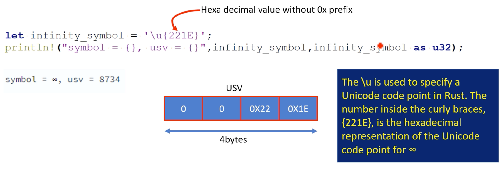

## char

- Rust 에서 `char` 데이터 유형은 **USV(Unicode Scalar Values)**를 사용하여 문자를 나타냅니다
- 유니코드는 전 세계 모든 쓰기 시스템의 모든 문자에 스칼라 값이라는 고유한 숫자를 할당하는 표준화된 문자 인코딩 시스템입니다. 이러한 스칼라 값은 0~0x10FFFF 범위에 속하며 `u32` 값으로 표현될 수 있습니다
- **유니코드 스칼라 값**. 상위 서로게이트 및 하위 서로게이트 코드 포인트를 제외한 모든 정수 코드 포인트. 즉, 유니코드의 범위는 0부터 D7FF_16까지, E000_16부터 10FFFF_16까지입니다
- `char` 프로그램 값은 사용된 플랫폼이나 유니코드 스칼라 값에 관계없이 "단일 문자"를 나타내는 4바이트 숫자입니다. 예를 들어 문자 'A'는 스칼라 값 65를 갖고 문자 'a'는 스칼라 값은 97이고 기호 "무한대"는 스칼라 값 8734를 갖습니다


`\u{}` 구문을 사용하여 Rust에서 `char` 유형 변수를 생성하기 위해 유니코드 스칼라 값을 사용하는 예




> `\u`는 Rust에서 유니코드 코드 포인트를 지정하는 데 사용됩니다. 중괄호 안의 숫자 '{221E}'는 `∞`에 대한 유니코드 코드 포인트의 16진수 표현입니다

https://en.wikipedia.org/wiki/List_of_Unicode_characters


### About `{u}` syntax

Rust 에서는 작은따옴표를 사용하여 문자 리터럴과 바이트 리터럴을 지정합니다

문자 리터럴은 단일 코드 포인트로 표현되는 단일 유니코드 문자입니다

코드 포인트 `'\u{221E}'`를 묶기 위해 `작은 따옴표`를 사용하면 단일 코드 포인트를 저장할 수 있는 문자 유형 변수를 생성하겠다는 것을 Rust 컴파일러에 알리는 것입니다


```rust
fn main() {
    let ka_in_kannada = '\u{C95}'; // let ka_in_kannada = 'ಕ';
    let ka_in_hindi = '\u{915}';
    let ka_in_chinese = '\u{5f00}';
    println!("{}\n{}\n{}", ka_in_kannada, ka_in_hindi, ka_in_chinese);
}
```
```
ಕ
क
开
```

## Converting u32 to char

```rust
fn main() {
    let usv_of_inf = 0x221e_u32;
    println!("symbol = {}", usv_of_inf as char); // Error
}
```

`u32` 값을 `char`로 변환하려면 `Option<char>`을 반환하는 `char::from_u32` 함수를 사용할 수 있습니다

> `char` 유형은 U+0000에서 U+10FFFF 범위의 값을 가질 수 있는 유니코드 스칼라 값을 나타냅니다. 그러나 모든 'u32' 값이 유효한 'char' 값은 아닙니다


```rust
fn main() {
    let usv_of_inf = 0x221e_u32;
    if let Some(inf_symbol) = char::from_u32(usv_of_inf) {
        println!("symbol = {}", inf_symbol);
    } else {
        println!("Not a valid Unicode scalar value");
    }
}
```


## bool

`bool` 유형은 `true` 또는 `false`일 수 있는 부울 값을 나타냅니다. 기본형으로 논리적 조건을 표현하는데 사용됩니다

`bool` 값은 `&&`(and) 및 `||`(or)와 같은 부울 연산은 물론 `==`, `!=`와 같은 비교 연산자와 같은 다양한 다른 컨텍스트에서도 사용될 수 있습니다. , `>`, `<`, `>=`, `<=` 등

```rust
fn main() {
    let is_raining = true;
    
    if is_raining {
        println!("Bring an umbrella!");
    } else {
        println!("Enjoy the sunshine!");
    }
}
```


