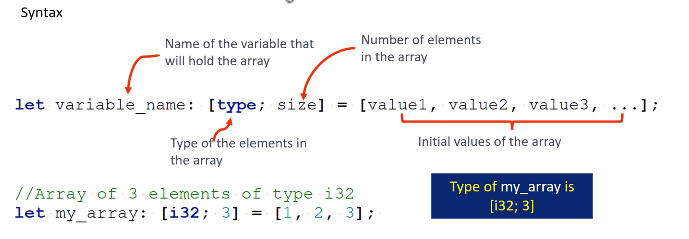

## Array

- 배열은 동일한 데이터 유형의 요소를 고정된 수만큼 보유하는 데이터 구조입니다
- 배열은 크기가 고정되어 있습니다. 즉, 배열의 크기는 컴파일 타임에 알려져야 하며 일단 생성되면 변경할 수 없습니다



```rust
fn main() {
    let my_array: [f64; 3] = [2.5, 4.0, 3.8];
    let my_array: [char; 2] = ['+', '-'];
}
```


- Rust 에서는 런타임에 배열의 크기를 지정하기 위해 변수를 사용하는 것이 불가능합니다. 배열의 크기는 컴파일 타임에 알려진 상수 표현식이어야 합니다
- 배열의 크기는 런타임에 수정될 수 없기 때문에 Rust에는 크기가 변경될 수 있는 `Vectors`라는 배열에 대한 동적 대안이 있습니다
- `Vectors`는 동적으로 할당된 배열 주위의 래퍼로 구현되며 요소를 푸시하고 팝하는 방법과 기타 유용한 기능을 제공합니다. 따라서 Rust 에서는 동적 배열을 원할 경우 `Vector`를 사용할 수 있습니다


## 이 배열의 유형은 무엇입니까?


`let my_array = [1, 2, 3_u8, 67, 89];`

`my_array`의 유형은 `[u8; 5]`. 이는 길이가 5인 `unsigned 8-bit integers`의 배열이라는 의미입니다. 배열의 요소 유형은 `u8`이고 배열의 크기는 5입니다


## Printing array

```rust
fn main() {
    let my_array = [1,2,3];

    /* `[{integer}; 3]` doesn't implement `std::fmt::Display` */
    println!("{}", my_array); //Error

    /*
    {:?} or {:#?} 사용된 형식 지정자
    사용되는 배열의 디버그 특성
    간결하고 읽기 쉬운 형식으로 배열을 인쇄하려면
     */
    println!("{:?}", my_array); //OK
    println!("{:#?}", my_array); //OK
}
```

- https://doc.rust-lang.org/stable/std/primitive.i32.html
- https://doc.rust-lang.org/stable/std/primitive.i32.html#impl-Display-for-i32
- https://doc.rust-lang.org/stable/std/primitive.array.html
- https://doc.rust-lang.org/stable/std/primitive.array.html#impl-Debug-for-%5BT;+N%5D


## Repeat expression

```rust
fn main() {
    /* 
     * 배열을 만들고 모든 요소를 0으로 초기화합니다
     * [V; N], V=value, N= repeat expression
     * V is repeated N times
     */
    let array2: [i32;10] = [0;10];

    /*
     * 4개 요소로 구성된 u8 유형의 배열을 생성하고
     * initialize all elements to 5
     */
    let array3 = [5_u8;4];
}
```


## Array indexing

```rust
fn main() {
    let array1 = [5, 4, 3, 2, 1];
    let element = array1[3];
    println!("{}", element);

    /*
    * 배열은 기본적으로 변경할 수 없으므로 수정할 수 없습니다
    */
    array1[3] = 10; // Error

    let mut array2 = [5_u8;5];
    array2[4] = 10; // OK
    println!("{:?}", array2); // [5, 5, 5, 5, 10]
}
```

## Iterating over an array

주어진 배열의 모든 요소를 더하고 결과를 인쇄하는 프로그램

```rust
fn main() {
    let my_array = [56, 78, -67, 56, 89, 45];
    let mut sum = 0;
    for i in my_array {
        sum = sum + i;
    }
    println!("Sum is {}", sum);
}
```

- 이 코드에서는 `for` 루프를 사용하여 `my_array` 배열의 요소를 반복합니다
- 루프 변수 `i`는 루프가 반복될 때마다 `my_array` 배열의 각 요소 값을 취합니다
- 따라서 첫 번째 반복에서 `i`는 56이 되고 두 번째 반복에서 `i`는 78이 되는 식으로 모든 요소가 처리될 때까지 계속됩니다
- `i`의 유형은 `my_array` 배열의 요소 유형인 `i32`입니다
- `for` 루프는 `my_array`의 요소 유형이나 배열이 사용되는 컨텍스트를 기반으로 `i` 유형을 자동으로 추론합니다