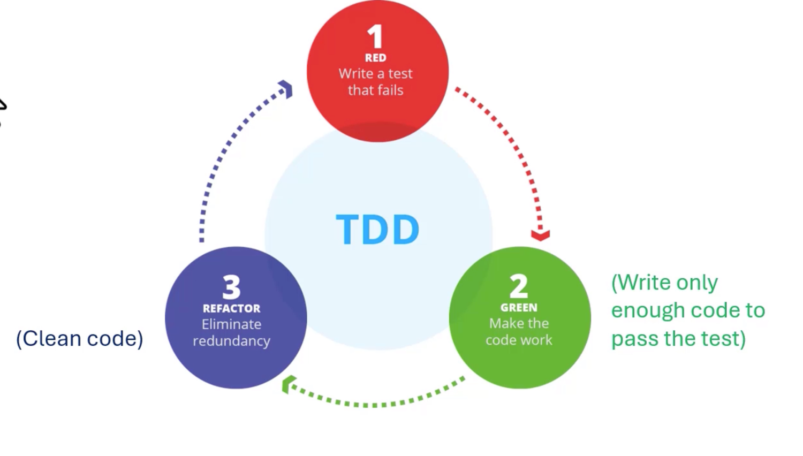
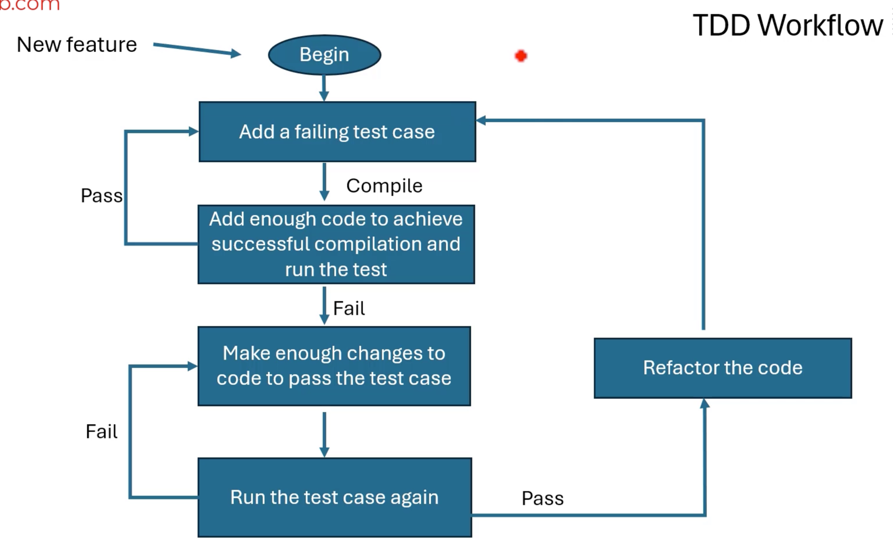

# Rust는 내장된 테스트 프레임워크를 제공합니다

- Rust 에는 표준 라이브러리의 일부인 내장 테스트 프레임워크가 포함되어 있습니다
- 이는 Rust 프로젝트에서 테스트 작성 및 실행을 시작하기 위해 추가 패키지나 라이브러리를 설치할 필요가 없음을 의미합니다
- 테스트 프레임워크는 **Cargo**와 완벽하게 통합되어 즉시 사용이 간편합니다
- 테스트 케이스를 작성하고 `cargo test`를 실행하기만 하면 됩니다

## Rust 에서 수행할 수 있는 다양한 유형의 테스트

1. Unite testing: 개별 기능, 메소드 또는 모듈을 개별적으로 테스트하여 예상대로 작동하는지 확인합니다
2. Integration Testing: 여러 구성 요소 또는 전체 모듈의 통합을 전체적으로 테스트하여 올바르게 함께 작동하는지 확인합니다
3. Documentation Testing (Doc-Tests): 문서(문서 주석)의 코드 예제가 정확하고 실행 가능한지 확인합니다

> Rust는 기본적으로 모의 객체를 지원하지 않습니다. 모의 객체를 수동으로 생성하거나 타사 라이브러리를 사용할 수 있습니다

## Software development practices

- Test-Driven Development (TDD)
- Test-Last Development (TLD)

## Test-Driven Development (TDD)

테스트는 소프트웨어 개발을 주도합니다

## Advantageous of TDD

- **Incremental development**
    - 한 번에 하나의 작은 테스트에 집중함으로써 소프트웨어를 관리 가능하고 테스트 가능한 부분으로 나누어 복잡성을 관리할 수 있습니다

- **Continuous feedback**
    - 테스트를 자주 실행하면 소프트웨어 개발 방법에 대한 즉각적인 피드백을 제공하고 프로세스 초기에 문제를 강조할 수 있습니다

- **Refinement and improvement**
    - 정기적인 리팩토링을 통해 코드베이스의 동작을 변경하지 않고 깔끔하게 유지합니다

## Test-Last Development (TLD)

- 테스트는 기능에 대한 코드가 개발된 후에 작성됩니다