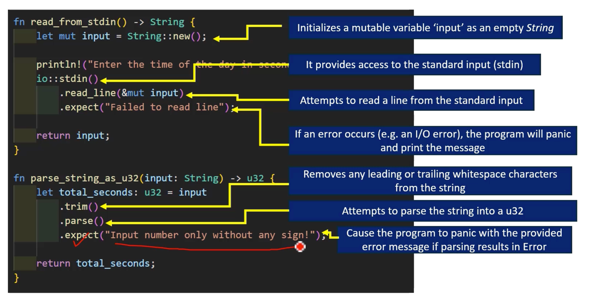
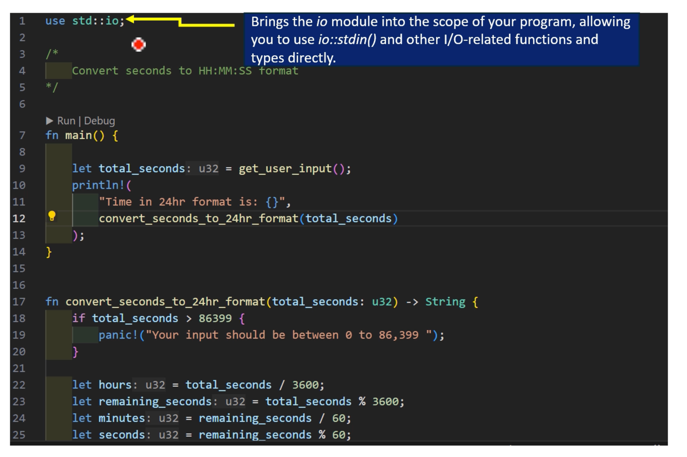

- mutable variable `input`을 빈 문자열로 초기화합니다
- 표준 입력(stdin)에 대한 액세스를 제공합니다
- 표준 입력에서 한 줄을 읽으려고 시도합니다
- 오류가 발생하면(예: I/O 오류) 프로그램은 'panic'을 일으키고 메시지를 인쇄합니다
- 문자열에서 선행 또는 후행 공백 문자를 제거합니다
- 문자열을 u32로 구문 분석하려고 시도합니다
- 구문 분석 결과 오류가 발생하면 제공된 오류 메시지로 프로그램이 패닉 상태가 됩니다







```rust
mod parse_user_input {
    //모든 테스트 케이스를 단위 테스트로 유지 get_user_input
    //1) 사용자가 0을 입력하면 함수는 0을 반환해야 합니다.
    #[test]
    fn test_user_enters_zero_function_must_return_zero() {
        assert_eq!(0, super::super::parse_string_as_u32("0\n\r".to_string()));
    }
    //2) 사용자가 정수를 입력하면 functin은 정수를 반환해야 합니다.
    //3) 사용자가 음수를 입력하면 함수는 패닉 상태가 됩니다.
    //4) 사용자가 10진수를 입력하면 함수는 패닉 상태가 되어야 합니다.
    //5) 사용자가 숫자 이외의 문자를 입력하면 함수가 패닉 상태가 됩니다.
    //6) 사용자가 아무것도 입력하지 않으면(Enter 키만 누르면) 함수는 패닉 상태가 됩니다.
    //7) 사용자가 u32의 최대값보다 큰 숫자를 입력하면 함수는 패닉 상태가 됩니다.
    #[test]
    // #[ignore] // Test Pass
    // cargo test --ignored // ignore 포함 모든 테스트 케이스 실행
    // cargo test -- --include-ignored // ignore 포함 모든 테스트 케이스 실행
    // https://doc.rust-lang.org/stable/std/primitive.u32.html#associatedconstant.MAX
    #[should_panic]
    fn test_user_enters_number_greater_than_max_u32_function_must_panic() {
        let some_big_number_as_string = "4294967296\n\r".to_string();
        super::super::parse_string_as_u32(some_big_number_as_string);
    }

}
```