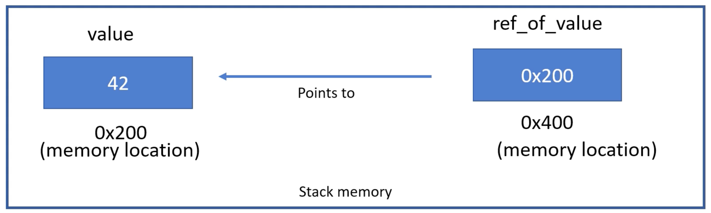

# Slice

- Rust의 슬라이스는 배열의 일부를 참조하는 데 사용되지만 문자열이나 벡터와 같은 다른 유형의 연속 데이터 구조를 참조하는 데에도 사용할 수 있습니다  
  슬라이스는 데이터의 하위 집합을 다루기 위한 유연하고 효율적인 방법을 제공하며 Rust 프로그래밍에서 일반적으로 사용되는 데이터 구조입니다
- 참조가 작동하는 방식과 Rust에서 참조가 사용되는 방식을 이해하면 슬라이스가 작동하는 방식과 배열 또는 기타 데이터 구조의 일부를 참조하는 데 슬라이스가 사용되는 방식을 더 잘 이해할 수 있습니다

# References

## Reference in Rust

Rust의 참조는 값의 메모리 위치를 참조한다는 점에서 C의 포인터로 생각할 수 있습니다. 그러나 참조는 몇 가지 중요한 측면에서 포인터와 다릅니다

- 참조는 기본적으로 변경할 수 없습니다
- `null`일 수 없으며 결코 매달리지 않습니다
- 빌림 검사기는 참조가 지정된 수명 동안만 유효하고 해당 수명보다 오래 지속되지 않도록 보장합니다


## Memory representation

```rust
fn main() {
    let value: i32 = 42;
    let ref_of_value = &value;
    println!("Value is {}",*ref_of_value); // 수동 역참조
    println!("Value is {}",ref_of_value); // 자동 역참조
}

```





- 여기서 `ref_of_value` 변수는 `value` 변수에 대한 참조입니다
- `값`의 유형은 `i32`입니다
- `ref_of_value` 유형은 `&i32`입니다


```
int main() {
    const int value = 42;
    const int *const pointer_to_value = &value;
    printf("Value = %d\n", *pointer_to_value);
}
```