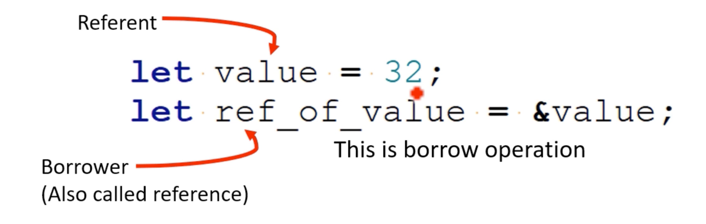

# Borrow, Borrower, Referent



- `&` 연산자를 사용하여 값에 대한 참조를 생성하는 것을 *빌림*이라고 합니다.
- 참조를 보유하는 변수를 차용자라고 합니다. 이 경우 차용인은 `ref_to_value`입니다
- 참조 대상은 참조가 가리키는 값 또는 변수입니다. 이 경우 지시 대상은 `variable value`입니다
- 차용을 통해 차용인은 소유권을 가지지 않고도 대상에 저장된 가치에 액세스할 수 있습니다

```rust
fn main() {
    let mut num1 = 50; // mutable referent
    let ref1 = &num1; // immutable borrow (type of 'ref1' is '&i32')
    *ref_of_num1 = 100; // Errpr
    println!("{}", num1);
}
```

```rust
// fn borrows the num1 as readonly
fn print_value(arg: &i32) {
    println!("{}", *arg);
}

fn main() {
    let num1 = 50; // immutable referent
    
    let ref_of_num1 = &num1; // immutable borrow
    let ref_of_num2 = &num1; // immutable borrow
    let ref_of_num3 = &num1; // immutable borrow
    let ref_of_num4 = &num1; // immutable borrow
    
    println!("{}", ref1); // immutable borrow
}
```


```rust
fn main() {
    let mut num1 = 50; // mutable referent
    let ref1 = &num1; // immutable borrow (type of 'ref1' is '&i32')
    // 변수를 변경 가능으로 빌려오고 이후 이를 불변으로 빌려오려고 하면 컴파일 에러가 발생
    let ref2 = &mut num1; // mutable borrow (type of 'ref2' is '&mut i32')
    
    // *ref1 += 1;
    *ref2 = 200; // 변경 가능으로 빌린 경우 다시 사용 불가
    println!("{}", num1);
    println!("{}", ref1); // num1은 ref1에서 불변으로 빌렸는데 ref2에서 다시 변경 가능으로 빌릴수 없다
}
```

## Single write or multiple read

Rust 에서는 동일한 변수에 대해 가변 빌림과 불변 빌림을 동시에 가질 수 없습니다  
이는 변수의 상태가 예기치 않게 변경되지 않도록 하기 위한 것입니다  
변수를 변경 가능하게 차용한 후에 이를 변경 불가능하게 차용하려고 하면 컴파일 시간 오류가 발생하며 그 반대의 경우도 마찬가지입니다