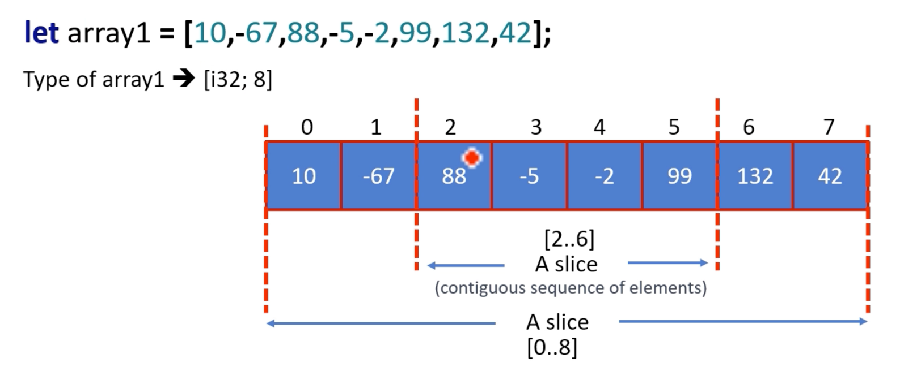
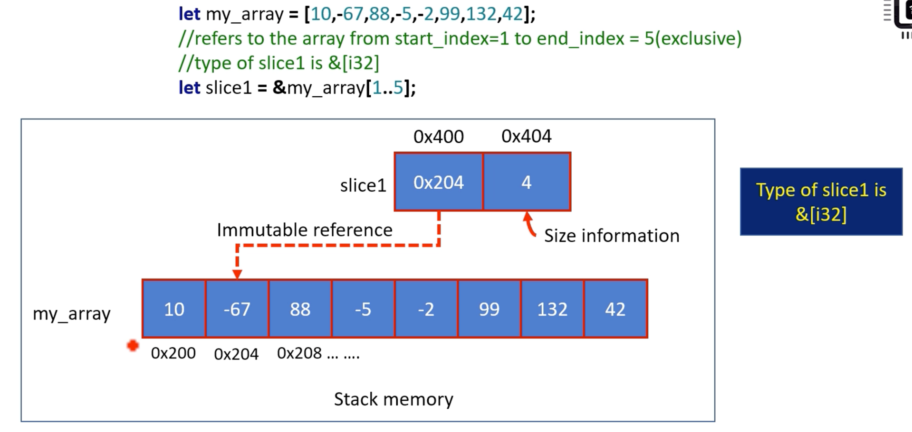

# Slices

- Rust 의 슬라이스는 배열의 일부를 참조하는 데 사용되지만 문자열이나 벡터와 같은 다른 유형의 연속 데이터 구조를 참조하는 데에도 사용할 수 있습니다  
  슬라이스는 데이터의 하위 집합을 다루기 위한 유연하고 효율적인 방법을 제공하며 Rust 프로그래밍에서 일반적으로 사용되는 데이터 구조입니다
- 참조가 Rust 에서 작동하는 방식과 사용되는 방식을 이해하면 슬라이스가 작동하는 방식과 배열 또는 기타 데이터 구조의 일부를 참조하는 데 슬라이스가 사용되는 방식을 더 잘 이해할 수 있습니다


## Slice of an Array

Rust에서 슬라이스는 배열에 있는 요소들의 연속적인 영역에 대한 참조입니다. `&[T]` 유형으로 표시됩니다. 여기서 T는 배열의 요소 유형입니다

슬라이스를 사용하면 전체 배열의 소유권을 갖지 않고도 배열의 일부를 빌릴 수 있으며 복사본을 만들지 않고도 안전하고 효율적인 방식으로 하위 배열을 사용할 수 있는 방법을 제공합니다

`&` 연산자를 사용하여 배열에서 슬라이스를 생성할 수 있습니다. 예를 들어 `let this_slice = &array[1..3];` 이렇게 하면 인덱스 1에서 2(`[2, 3]`)까지 배열의 슬라이스가 생성됩니다

```rust
fn main() {
    // slice of an array
    let my_array: [i32; 4] = [1, 2, 3, 4];
    // let s1 = &my_array[1..3]; // borrow 를 사용해야됨 item 2, 3
    // borrow 를 사용해야됨 item 2, 3 and 4
    let s1 = &my_array[1..=3]; // s1 is a slice whose type is &[i32]
    let s2 = &my_array[..]; // 1, 2, 3, 4
    let s3 = &my_array[0..=1]; // 1, 2

    println!("{:?}", s1);
    println!("{:?}", s2);
    println!("{:?}", s3);
}
```

## Slice

- 슬라이스를 생성할 때 원래 배열의 어떤 요소가 슬라이스에 포함되는지 결정하는 인덱스 범위를 지정합니다  
  슬라이스 자체는 이 요소 시퀀스에 대한 참조이며 이를 사용하여 슬라이스의 요소를 읽고 수정할 수 있습니다
- 슬라이스는 원래 배열에 대한 참조일 뿐이므로 슬라이스의 요소를 수정하면 원래 배열의 해당 요소도 수정됩니다  
  마찬가지로 원본 배열에 대한 모든 변경 사항도 조각에 반영됩니다
- 슬라이스는 배열뿐만 아니라 Rust의 벡터 및 기타 컬렉션에서도 생성될 수 있습니다




## Range expression (`..`)

`..`는 Rust 에서 **범위 표현 연산자**라고도 합니다. 이는 값 범위를 생성하고 배열 분할, for 루프 생성 및 패턴 일치와 같은 값 시퀀스를 지정하기 위해 다양한 컨텍스트에서 사용됩니다

| Production         | Syntax         | Type                        | Range               |
|--------------------|----------------|-----------------------------|---------------------|
| RangeExpr          | start .. end   | `std::ops::Range`           | start ≤ x < end     |
| RangeFromExpr      | start ..       | `std::ops::RangeFrom`       | start ≤ x           |
| RangeToExpr        | .. end         | `std::ops::RangeTo`         | x < end             |
| RangeFullExpr      | ..             | `std::ops::RangeFull`       | x : _               |
| RangeinclusiveExpr | start .. = end | `std::ops::Rangeinclusive`  | start ≤ x ≤ end     |
| RangeToinclusiveExpr| ..= end       | `std::ops::RangeToinclusive` | x send              |




- 0x200은 my_array 배열의 첫 번째 요소가 발견된 메모리 위치(주소)입니다
- 0x400은 *참조* 정보가 저장되는 슬라이스의 메모리 위치입니다
- 0x404는 *크기* 정보가 저장되는 슬라이스의 메모리 위치입니다

```rust
fn main() {
    let mut my_array = [-56, 22, 3, 444, 90];
    let s1 = &mut my_array[1..=3];
    // println!("{}", s1[5]); // panic! out of bounds
    s1[2] = 100;
    println!("{:?}", my_array); // [-56, 22, 3, 100, 90]
}
```


## Iterating over the slice of an array

주어진 배열에서 크기가 4인 슬라이스를 생성하고, 슬라이스에 있는 모든 요소의 합을 계산하고, 결과를 인쇄하는 프로그램을 작성하세요

`let my_array = [10,-67,88,-5,2,99,132,42];`


## Iterating over the slice

Note

1. `slice` 변수는 정수 조각에 대한 참조입니다
2. `for` 루프가 반복될 때마다 루프 변수 'i'에 슬라이스의 요소에 대한 다른 참조가 할당됩니다
3. 따라서 `i`의 유형은 `&i32`로 작성된 정수에 대한 참조입니다
4. 슬라이스를 반복할 때 루프 변수는 슬라이스의 각 요소 값이 아닌 슬라이스의 각 참조 값을 사용합니다. 이것이 `i`가 `&i32` 유형을 갖는 이유입니다

```rust
fn type_of<T>(_: &T) -> String {
    format!("{}", std::any::type_name::<T>())
}

fn main() {
    let my_array = [10, -67, 88, -5, -2, 99, 132, 42];
    let slice = &my_array[..=3]; // 10, -67, 88, -5
    let mut sum = 0; // 슬라이스의 모든 요소의 합
    
    for &i in slice { // type of i is i32 
        sum = i + sum;
        println!("{}", type_of(&i))
    }
    println!("sum {}", sum); // sum 26
}
```