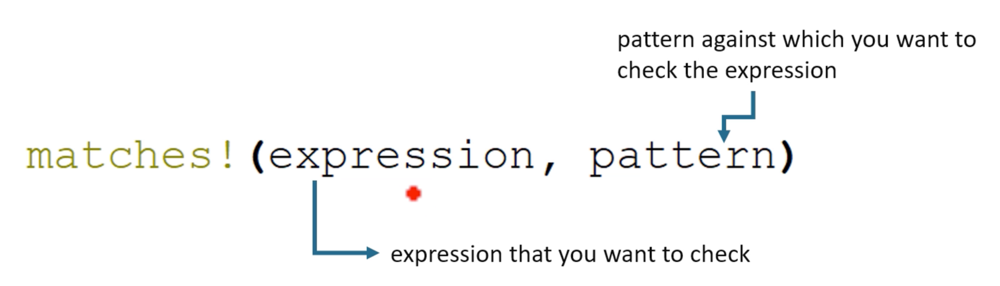

# match

```
Syntax
match value {
    pattern => expression,
    pattern => expression,
    ...
    _=> expression
}
```

- `Value`은 다양한 패턴과 일치합니다
- `Value`이 `pattern`과 일치하면 => 오른쪽의 코드가 실행됩니다
- `_`는 어떤 `Value`과도 일치하는 `catch-call pattern`이며 기본 사례로 사용됩니다.

`match` 문은 값에 대한 일치를 수행하고 값과 일치하는 패턴에 따라 다른 코드를 실행하는 데 사용됩니다  
값과 일치하는 패턴이 없으면 포괄적인 패턴(`_`)이 실행됩니다


## `match` statement is an exhaustive match by default

```rust
fn main() {
    let x = 5;

    match x {
        1 => println!("one"),
        2 => println!("two"),
    }
}
```

```rust
fn main() {
    let x = 5;

    match x {
        1 => println!("one"),
        2 => println!("two"),
        _ => println!("other"),
    }
}
```

Rust에서 `match` 문은 기본적으로 완전한 일치입니다  
이는 여러 경우가 포함된 `match` 표현식이 있는 경우 가능한 모든 경우를 명시적으로 처리해야 하며 그렇지 않으면 Rust 컴파일러가 컴파일 시간 오류를 생성한다는 의미입니다

## Example

`match` 문을 사용하여 여러 가지 패턴에 대해 튜플의 값을 확인합니다. 각 패턴은 수행할 특정 작업에 해당합니다

- 튜플의 두 번째 항목이 음수이면 코드는 두 번째 항목이 음수임을 나타내는 메시지를 인쇄하고 "action 1"을 수행합니다
- 튜플의 두 항목이 모두 0인 경우 코드는 두 항목이 모두 0임을 나타내는 메시지를 인쇄하고 "action 2"를 수행합니다
- 튜플이 이러한 패턴 중 어느 것과도 일치하지 않으면 코드는 모두 괜찮다는 메시지를 인쇄합니다

```rust
fn main() {
    let point = (0,0);

    match point {
        (_, y) if y < 0 => {
            println!("Second element is negative: {}", y);
            println!("Take action 1");
        }
        (0, 0) => {
            println!("Point is zero");
            println!("Take action 2");
        }
        _ => println!("All fine"),
    }
}
```

## Example

배열에 음수가 포함되어 있는지 확인하고 그에 따라 플래그 변수 `invalid_array`를 업데이트합니다

### `|` symbol in match expression

- 일반적으로 "pipe" 또는 "vertical bar"라고 합니다
- `|` 기호는 여러 패턴을 동일한 코드를 실행해야 하는 단일 일치 부분으로 결합하는 데 사용됩니다. 이를 통해 동일한 결과를 갖는 패턴을 그룹화하고 더 간결하고 읽기 쉬운 코드를 작성할 수 있습니다

```rust
fn main() {
    let array = [1, -2, 3, 4];

    let invalid_array = match array {
        [n, _, _, _] | [_, n, _, _] | [_, _, n, _] | [_, _, _, n] if n < 0 => true,
        _ => false,
    };

    if invalid_array {
        println!("Array is invalid");
    } else {
        println!("Array is valid");
    }
}
```

## `matches!()` macro

(확인하고 싶은 표현, 표현식을 확인하려는 패턴)



매크로는 표현식이 주어진 패턴과 일치하는지 평가하고 부울 값을 반환합니다(일치하면 true, 그렇지 않으면 false)

```rust
fn main() {
    let array = [1, -2, 3, 4];

    let invalid_array = matches!(array1, [n, _, _, _] | [_, n, _, _] | [_, _, n, _] | [_, _, _, n] if n < 0);

    if invalid_array {
        println!("Array is invalid");
    } else {
        println!("Array is valid");
    }
}
```