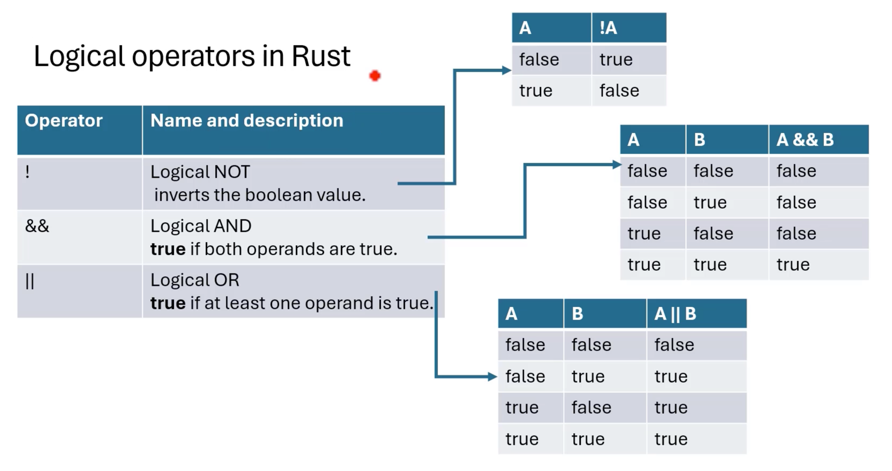

# 비교 연산자 in Rust

- 비교 연산자는 이항 연산자입니다. 즉, 일반적으로 두 개의 피연산자를 사용합니다
- 이 연산자는 두 피연산자를 비교하고 비교 결과에 따라 부울 값을 반환합니다

| Operator | Name          | Description                                            | Traits     |
|----------|---------------|--------------------------------------------------------|------------|
| `==`       | Equal to      | 값이 같은지 확인합니다                             | PartialEq  |
| `!=`       | Not equal to  | 값이 같지 않은지 확인합니다                          | PartialEq  |
| `>`        | Greater than  | 왼쪽 값이 오른쪽 값보다 큰지 확인합니다     | PartialOrd |
| `<`        | Less than     | 왼쪽 값이 오른쪽 값보다 작은지 확인합니다        | PartialOrd |
| `>=`       | Greater than or equal to   | 왼쪽 값이 오른쪽 값보다 크거나 같은지 확인합니다 | PartialOrd |
| `<=`       | Less than or equal to      | 왼쪽 값이 오른쪽 값보다 작거나 같은지 확인합니다                            | PartialOrd |

```rust
fn main() {
    let a = 10;
    let b = 20;
    let c = a == b; // type of c is bool
    let c = b > a;
    if a == b {} else if a > b {}
}
```

## 비교 연산자를 제어하는 특성

1. **PartialEq** 특성은 `==`(동등) 및 `!=`(동등 아님) 연산자를 제어합니다
2. **PartialEq**를 구현하면 이러한 연산자를 사용자 정의 데이터 유형과 함께 사용할 수 있습니다
3. **PartialOrd** 특성은 보다 작음(`<`), 보다 큼(`>`), 작거나 같음(`<=`) 및 크거나 같음(`>=`)을 제어합니다. 비교 연산자

## Rust의 논리 연산자



```rust
// logical operatior
fn main() {
    let a = true; // bool
    let b = !a; // b is now false
    println!("a:{a}, b:{b}")
}
```

* 논리 연산자 `&&` 및 `||`는 이진 연산자입니다. 즉, 두 개의 피연산자를 사용합니다
* `!`(논리적 Not)은 단항 연산자입니다. 즉, 단일 피연산자에 대해 작동함을 의미합니다
* 피연산자는 반드시 부울 유형(예: true 또는 false)이어야 합니다
* 논리 연산자는 어떤 특성에도 영향을 받지 않습니다. 이는 논리적 동작이 부울 값(bool)에 직접 고정되고 해당 작업이 작동하며 다른 유형에 대해 오버로드될 수 없기 때문입니다

```rust
// logical operatior
fn main() {
    let a = true; // bool
    let b = !a; // b is now false
    let c = !(a && b) || a; // c is false
    println!("a:{a}, b:{b}, c:{c}")
}
```