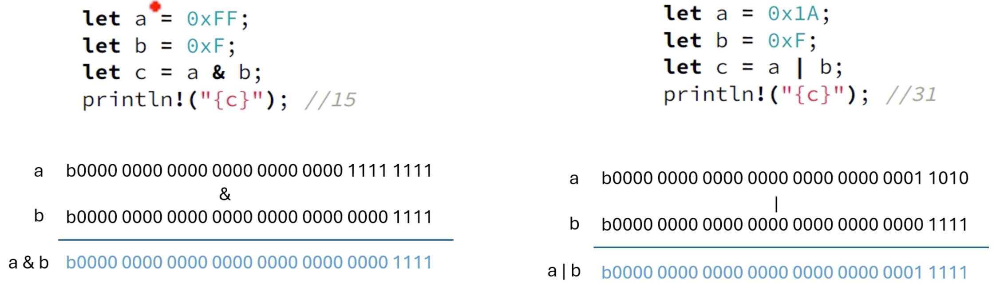
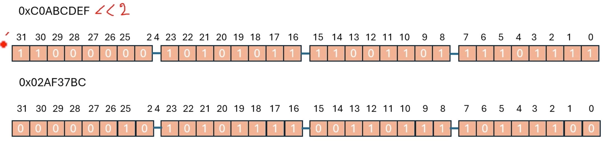
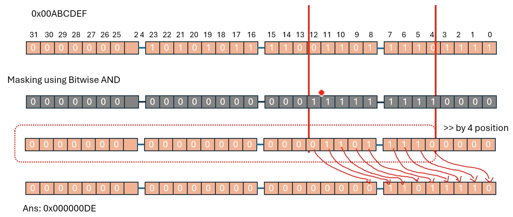

# 비트 연산자 in Rust

| Operator | Operation           | Associated Trait |
|---------|---------------------|------------------|
| `!`       | Bitwise Complement  | Not              |
| `&`       | Bitwise AND         | BitAnd           |
| `|`       | Bitwise OR           | BitOr            |
| `^`       | Bitwise exclusive OR | BitXor           |
| `<<`      | Left shift          | Shl              |
| `>>`      | Right shift         | Shr              |


```
!acts as Bitwise NOT
let x = 0b0000_1111_u8; // In binary: 00001111
let y = !x;             // Results in 11110000 (inverted bits)
```

```
!acts as Logical NOT
let a = true;
let b = !a; // Results in false
```

Rust 에는 C 에서처럼 비트별 NOT 에 대한 `~` 연산자가 없습니다

## Bitwise AND and Bitwise OR



## Bitwise Left Shift (`<<`)

`let c = a << b;`

피연산자(a)의 모든 비트를 지정된 위치(n)만큼 왼쪽으로 이동합니다. 오른쪽에는 0이 채워져 있습니다




음수를 충분히 왼쪽으로 이동하면 부호 비트가 가장 중요한 위치에서 벗어나면 양수 또는 0이 될 수 있습니다

```rust
fn main() {
    let a = -2_i8; // 1111 1110
    let b = a << 1; // 1111 1100
    println!("{b}"); // -4
}
```

## Bitwise Right Shift (`>>`)

- 피연산자의 모든 비트를 지정된 위치만큼 오른쪽으로 이동합니다. 부호가 없는 숫자의 경우 왼쪽에 0이 채워집니다. 부호 있는 숫자의 경우 부호 비트(최상위 비트)가 복제됩니다
- 오른쪽 시프트 연산은 부호 있는 정수에 대한 '산술 시프트'입니다. 즉, 왼쪽의 시프트된 비트를 부호 비트로 채워 정수의 부호를 보존한다는 의미입니다

```rust
fn main() {
    let a = 0x80_i8; // 1000 0000 (-128)
    let b = a >> 2; // 1110 0000 (-32)
    println!("a={a}, b={b}"); // -32
}
```





```rust
fn main() {
    // 숫자의 4~12번째 비트 위치 추출
    let num = 0x00ABCDEF;
    let mask = 0x1FF << 4; // 0000 0000 0000 0000 0001 1111 1111 0000
    let res = ((num & mask) >> 4) & 0x1FF;
    println!(",{:#X}", res); // 000001DE
}
```

