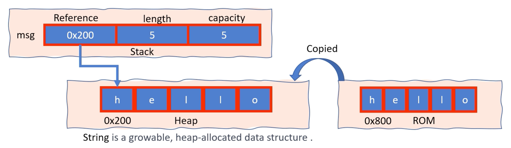

# Strings in Rust

Rust 의 다양한 문자열 유형:

1. String Literal (`&str`): 바이너리로 UTF-8로 인코딩된 문자 시퀀스를 가리키는 문자열 조각으로, 소스 코드의 문자열 리터럴에서 생성되는 경우가 많습니다. 고정된 크기를 갖고 있습니다
   
`let message = "Good Morning"; // 이것은 문자열 리터럴입니다. 프로그램 바이너리에는 "Good Morning"이라는 텍스트 정보가 하드코딩되어 있습니다`

2. `String`: 콘텐츠를 음소거하는 방법을 제공하고 동적 크기를 갖는 소유된 힙 할당 문자열 유형입니다


## String literal

문자열 리터럴은 항상 변경할 수 없습니다. 즉, 컴파일 시간 동안 수정됩니다

코드에서 문자열 리터럴 'Hello World' 는 변경할 수 없습니다. 즉, 변경 가능한 참조를 사용하여 이를 수정하거나 길이를 늘리거나 줄일 수 없습니다

```rust
fn main() {
    // type of 'greeting' is &str
    // thge string literal "Hello World" cannot be modified
    let greeting = "Hello World";
    println!("{}", greeting);r
}
```

## The String data type

프로그램 실행 중에 수정할 수 있는 변경 가능한 문자열을 생성하려면 문자열 리터럴 대신 'String' 유형을 사용하세요

```rust
fn main() {
    // create a new mutable
    // 문자열 유형의 변수 'greeting'
    let mut greeting = String::from("Good morning");
    
    // replace "morning" with "evening"
    greeting = greeting.replace("morning", "evening");
    
    // append ", world!" to the string
    greeting.push_str(", world!");
    
    println!("{}", greeting); // prints "Good evening, world!"
}
```

String 유형은 컴파일 타임에 문자열 길이를 알 수 없거나 사용자 입력을 받아 처리하는 등 런타임 중에 문자열 길이를 수정해야 하는 경우에 사용됩니다


## Creating an empty String:

`let my_string = String::new();`

- `my_string`은 Rust에서 문자열 변수 또는 문자열 인스턴스입니다
- `new()`는 String 타입의 메소드 중 하나입니다
- 문자열 유형(구조체)은 std 크레이트의 일부인 `std::string::String` 모듈에 정의됩니다
- `String::new()`를 호출하면 힙에 빈 버퍼가 있는 String 구조체의 새 인스턴스가 생성됩니다
- 버퍼는 처음에 0바이트 용량으로 할당되지만 문자열에 문자를 추가하면 동적으로 늘어날 수 있습니다
- String 구조체는 또한 버퍼의 유효한 바이트 수인 문자열 길이와 버퍼에 할당된 총 바이트 수인 버퍼 용량을 추적합니다

더 알아보기: https://doc.rust-lang.org/std/string/struct.String.html


## 문자열 리터럴을 사용하여 문자열 만들기

from은 유형 간 변환을 허용하는 `From` 특성에 정의된 함수입니다
`String::from()` 함수는 이 특성을 사용하여 구현됩니다

```rust
fn main() {
    let my_string = String::from("Hello, world!");
    
    // 이는 `from` 메소드를 사용하는 것과 동일합니다
    let my_string = "Hello, world!".to_string();
}
```

https://doc.rust-lang.org/stable/std/string/trait.ToString.html

```rust
fn main() {
    let mut num_as_string = 3.1416.to_string();
    num_as_string.insert_str(0, "PI = ");
    println!("{}", num_as_string); // Output: PI = 3.1416
}
```

https://doc.rust-lang.org/stable/std/string/trait.ToString.html#tymethod.to_string

## Memory representation

`let msg = String::from("hello");`



- **Length**는 문자열의 현재 내용에 있는 바이트 수를 나타냅니다
- **Capacity**은 메모리를 재할당하지 않고 문자열이 보유할 수 있는 바이트 수(OS에서 수신된 총 바이트 수)를 나타냅니다

## Heap clean up when string goes out of scope

```rust
fn main() {
    {
        let msg = String::from("Hello world");
    } // 문자열을 보관하기 위해 할당된 힙 메모리는 자동으로 할당 해제됩니다.
    // 변수 'msg' 는 여기서 더 이상 유효하지 않습니다
    println!("{}", msg); // Error
}
```

- `msg`가 범위를 벗어나면 Rust는 자동으로 문자열에 사용된 힙 메모리 할당을 해제하는 drop 함수를 호출합니다
- Rust는 메모리 할당 및 할당 해제를 관리하기 위해 가비지 수집기나 런타임 시스템에 의존하지 않습니다  
  대신 Rust는 소유권, 차용 및 수명의 조합을 사용하여 컴파일 타임에 메모리 안전성을 보장합니다
- Rust 컴파일러는 `String` 값과 같이 정리가 필요한 범위를 벗어나는 모든 값에 대해 자동으로 `drop` 메서드를 호출하는 코드를 삽입합니다
- `drop` 메소드는 Rust 표준 라이브러리의 `Drop` 특성에 정의되어 있습니다

## Shallow copy

`String` 값이 다른 변수에 할당되면 변수에는 원래 `String` 값의 포인터, 길이 및 용량의 복사본이 할당되지만 기본 힙 메모리는 복사되지 않습니다. 이를 얕은 복사본 또는 참조에 의한 복사본이라고 합니다

```rust
fn main() {
    let s1 = String::from("hello");
    let s2 = s1; // s1 is now invalid
    println!("{}, world!", s2); // s2는 s1과 동일한 메모리를 가리킵니다
}
```

`let s2 = s1; // s1 is now invalid`

얕은 복사 (Move)


이는 문자열의 전체 내용을 복사하는 것이 아니라 소량의 데이터(memory address, len, capacity)만 복사하기 때문에 빠른 작업입니다

```rust
fn main() {
    let s1 = String::from("hello");
    let s2 = s1.clone();
}
```

복제는 새 메모리를 할당하고 원본 문자열의 데이터를 새 위치에 복사해야 하기 때문에 단순 복사본보다 비용이 더 많이 드는 작업입니다


Rust에서는 모든 데이터 조각이 특정 시간에 단일 소유자를 가집니다

참고: 참조 횟수(RC) 유형은 엄격한 단일 소유권 규칙의 예외입니다


```rust
// ownership
fn main() {
    let s1 = String::from("hello");
    let s2 = s1; //move
    println!("{}", s2); // OK
    println!("{}", s1); // Error
}
```

```rust
// ownership
fn main() {
    let n1 = 10;
    let n2 = n1; // 이것은 움직이는 것이 아닙니다. 이건 카피라고 해야합니다
    println!("{}", n1);
    println!("{}", n2);
}
```