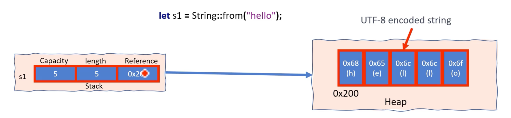

## Strings are stored in UTF-8 format in Rust

* Rust의 문자열과 문자열 리터럴은 UTF-8로 인코딩된 바이트로 저장됩니다
* UTF-8(Unicode Transformation Format)은 문자의 유니코드 스칼라 값을 컴퓨터 메모리에 저장하는 효율적인 인코딩 기술입니다
* UTF-8은 일부 문자를 1바이트 단위로 표현할 수 있으며, 2, 3, 4바이트 단위로 문자를 표현할 수도 있습니다  
  UTF-8의 "8"은 8비트 가변 너비 인코딩이라는 사실을 나타냅니다  
  즉, 문자를 나타내는 데 사용되는 바이트 수가 문자의 유니코드 스칼라 값에 따라 1에서 4까지 다양함을 의미합니다

ASCII 문자 세트에는 128자(7비트 값)만 포함되고 처음 128개의 유니코드 코드 포인트는 ASCII와 동일하므로 ASCII 문자의 UTF-8 인코딩은 항상 단일 바이트를 사용합니다  
따라서 모든 ASCII 문자열은 유효한 UTF-8 문자열입니다

ASCII 문자는 단일 바이트를 사용하여 표현되는 반면 무한대 기호, 이모티콘과 같은 다른 문자는 UTF-8 인코딩에서 여러 바이트가 필요합니다