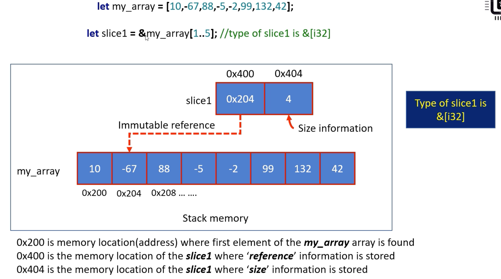

# Slice of a String



- 0x200은 my_array 배열의 첫 번째 요소가 발견된 메모리 위치(주소)입니다
- 0x400은 *참조* 정보가 저장되는 슬라이스의 메모리 위치입니다
- 0x404는 *크기* 정보가 저장되는 슬라이스의 메모리 위치입니다

String slices 는 Rust에서 `&str` 유형으로 표현됩니다

```rust
fn main() {
    let s1 = String::from("hello");
    // 's2' is a slice of type &str
    let s2: &str = &s1[0..=3];
    println!("{}", s2); // output: hell

    // 문자열 리터럴은 실제로 문자열 조각입니다
    
    // s3의 유형은 실제로 문자열 슬라이스, s3가 스택에 있어야함
    // Stack에는 S3의 주소값이 저장되고 ROM 힙에는 실제 데이터가 저장됨
    let s3 = "hello!";
}
```

## Primitive Type 'str' vs Primitive Type 'slice'

- `str`은 변경할 수 없는 UTF-8 문자 시퀀스를 나타냅니다. 안전한 읽기 전용 작업을 허용하는 `&str` 참조를 사용하여 액세스됩니다
- Rust의 "슬라이스"는 연속된 요소 시퀀스의 동적 보기입니다. 불변 접근의 경우 `&[T]`로 접근할 수 있고, 가변 접근의 경우 `&mut [T]`로 접근할 수 있습니다

```rust
fn main() {
    let greeting: String = "Hello, World!".to_string();
    let hello = &greeting[0..5];
    println!("{}", hello); // Output: Hello

    let numbers = [1, 2, 3, 4, 5];
    let slice_of_numbers = &numbers[1..4];
    println!("{:?}", slice_of_numbers); // Output: [2, 3, 4]
}
```

- https://doc.rust-lang.org/stable/std/primitive.str.html
- https://doc.rust-lang.org/stable/std/primitive.slice.html

```rust
// str vs slice
fn main() {
    let mut greeting: String = "Hello, World!+∞".to_string();
    let hello: &mut str = &mut greeting[0..5]; //&str
    
    println!("{}", hello);

    let mut numbers = [1, 2, 3, 4, 5];
    let slice_of_numbers: &mut [i32] = &mut numbers[1..4];
    slice_of_numbers[0] = 99;
    println!("{:?}", slice_of_numbers);
}
```