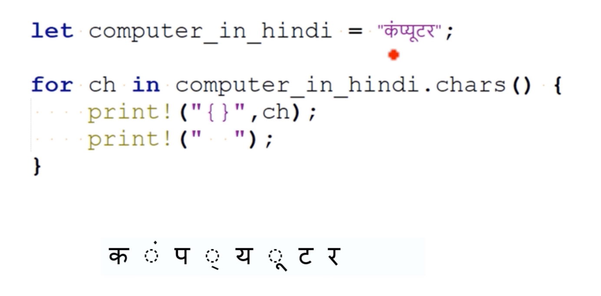

# String concatenation

`+` 연산자를 사용하여 두 개 이상의 문자열을 연결하고 새 문자열을 생성할 수 있나요?


```rust
use unicode_segmentation::UnicodeSegmentation;

fn main() {
    let computer_in_hindi = "कंप्यूटर";
    println!("Hindi word: {}", computer_in_hindi);
    
    println!("All characters of the string: ");
    for ch in computer_in_hindi.chars() {
        print!("{}", ch);
        print!("  ");
    }
    
    println!();
    
    println!("Total chars: {}", computer_in_hindi.chars().count());

    // Convert string to byte array
    let byte_array = computer_in_hindi.as_bytes();
    println!("Byte array: {:?}", byte_array);

    // Convert string to grapheme cluster iterator and print
    let graphemes = computer_in_hindi.graphemes(true);

    for grapheme in graphemes {
        println!("Grapheme: {}", grapheme);
    }

}
```



```
Hindi word: कंप्यूटर
All characters of the string: 
क  ं  प  ्  य  ू  ट  र  
Total chars: 8
Byte array: [224, 164, 149, 224, 164, 130, 224, 164, 170, 224, 165, 141, 224, 164, 175, 224, 165, 130, 224, 164, 159, 224, 164, 176]
Grapheme: कं
Grapheme: प्
Grapheme: यू
Grapheme: ट
Grapheme: र
```