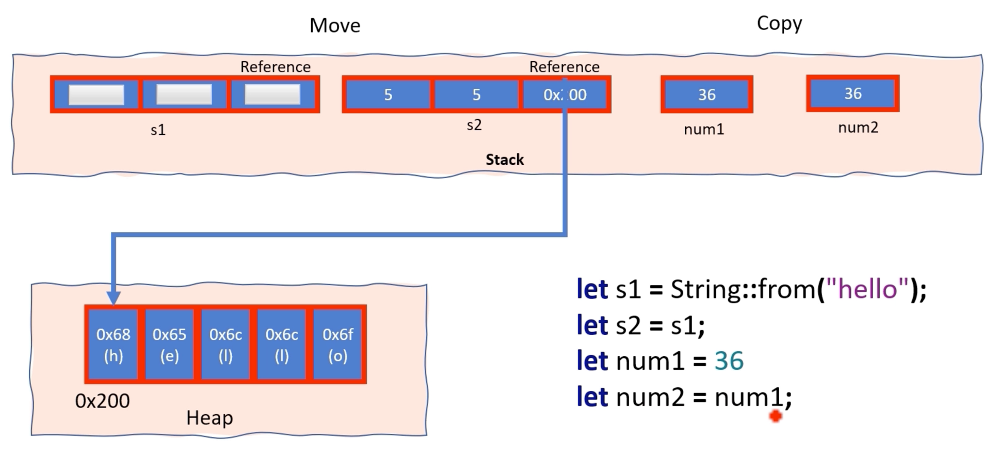

## Ownership

- Rust에서는 모든 값의 수명을 결정하는 단일 소유자가 있습니다.
- Rust에는 C++처럼 free 또는 delete 키워드가 없습니다  
  대신 Rust는 "소유권"이라는 개념과 "drop"이라는 메커니즘을 사용하여 메모리를 관리합니다
- 소유자는 값이 범위를 벗어날 때 값과 관련된 메모리 할당을 해제할 책임이 있습니다
- 변수의 소유권은 이동되거나 복사될 수 있습니다

## Move

- 값의 소유권은 이동 의미를 사용하여 변수나 함수 간에 이전될 수 있습니다. 이동이 발생하면 이전 소유자는 더 이상 해당 값에 액세스할 수 없습니다. 이는 다른 프로그래밍 언어에서 발생할 수 있는 **use-after-free** 버그와 같은 문제를 방지합니다
- `String`, `Vec` 및 힙에 메모리를 할당하는 기타 복잡한 유형과 같은 힙 할당 데이터 유형에서 이동이 발생합니다
- `Move`는 `Copy` 특성을 구현하기 때문에 `integer`, `char`, `float`, `bool` 및 기타 간단한 스택 기반 데이터 유형과 같은 기본 데이터 유형에는 적용되지 않습니다
- `Copy` 특성을 구현하는 다른 유형으로만 구성된 유형도 자동으로 Copy로 간주됩니다. 예를 들어 `i32`와 `bool`은 모두 복사이므로 `i32` 및 `bool` 필드만 포함하는 구조체도 복사입니다

## Copy

- 변수의 소유권이 복사되면 해당 데이터를 포함하여 원래 변수의 전체 복사본인 새 변수가 생성됩니다
- `Copy` 특성을 구현하는 유형은 새 변수에 할당되거나, 함수 인수로 전달되거나, 함수에서 반환될 때 자동으로 복사됩니다




```rust
fn main() {
    // s1 is the owner of the string "hello"
    let s1 = String::from("hello");
    
    // Ownership of 's1' is transferred to 's'
    // 'fun1' returns ownership of 's' back to s2
    let s2 = fun1(s1); // Ownership of 's' back to s2
    
    println!("{}",s2); //Ok
    // println!("{}",s1); //Error
}

fn fun1(mut s: String) -> String {
    println!("{}",s);
    
    s.push_str(" world");
    
    s // Ownership returned
}
```


```rust
fn main() {
    let array1 = [5, 6, 7, 8]; //[i32; 4]
    
    let array2: [String; 3] = [
        String::from("foo"),
        String::from("bar"),
        String::from("baz"),
    ];
    
    let item = array1[1];
    
    println!("{}", item);

    let str_item = array2[1];

    println!("{}", str_item);
}
```

### &mut T is Move while &T is Copy

```rust
fn main() {
    let msg = "Hello".to_string();
    let ref1 = &msg;
    let ref2 = ref1;
    
    /*
    이는 참조 자체가 아닌 참조가 가리키는 값을 비교합니다
    이는 코드가 ref1과 ref2가 가리키는 데이터가 동일한지 확인한다는 의미입니다
     */
    if ref1 == ref2 {
        println!("Both refs are pointing to the same data");
    }
}
```

### &mut T is Move

```rust
fn main() {
    let mut msg = "Hello".to_string();
    let ref1 = &mut msg;
    let ref2 = ref1; // Move
    
    // Error 'ref1' move to 'ref2'
    if ref1 == ref2 {
        println!("Both refs are pointing to the same data");
    }
}
```

https://doc.rust-lang.org/stable/std/primitive.reference.html