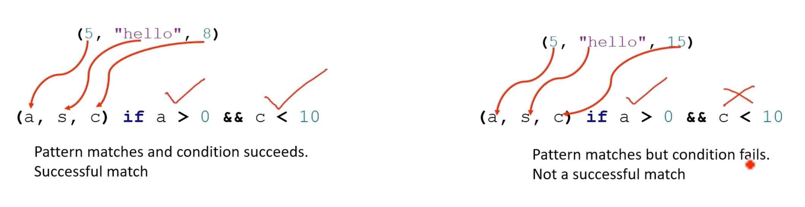

# Pattern matching using tuple

첫 번째 요소가 0보다 크고 마지막 요소가 10보다 작은 경우에만 중간 요소를 처리합니다

```rust
fn main () {
    let rovd_data = (5, "hello", 8) ;
    match revd_data {
        (a, s, c) if a > 0 && c < 10 => {
            println! ("Valid data: s = {}", s) ;
        }
        _ => println! ("Invalid data") ,
    }
}
```



```rust
fn main() {
    let tup = (5, "SOP", 8);
    
    match tup {
        (_, "SOP", _) => println!("Middle element is 'SOP'"),
        _ => println!("Middle element is not 'SOP'"),
    }
}
```

이는 첫 번째 및 세 번째 요소의 값에 관계없이 중간 요소가 '5D3P'인 모든 튜플과 일치합니다

```rust
fn main() {
    let tup = (1, "hello", true);
    
    match tup {
        (1, s, true) => println!("The second element is {}", s),
        _ => println!(),
    }
}
```

특정 값의 특정 요소와 일치

## Tuple match with range expression

```rust
fn main() {
    let tup = (1, 2, 20);

    match tup { 
        (_, _, c @ 10..=20) => {
            println!("c is between 10 and 20");
            println!("C is {}", c);
        }
        _ => (),
    }
}
```

범위 표현식이 뒤따르는 `@` 기호는 패턴 일치에서 일치되는 패턴 값에 대한 바인딩을 생성하는 동시에 일치하는 값이 지정된 범위 내에 있는지 확인하는 데 사용됩니다


## 일부 요소를 무시하기 위해 나머지 연산자(..)를 사용하는 튜플과의 패턴 일치

```rust
fn main() {
    let tup = (1, "hello", 2.5, true, 'a');
    
    match tup {
        (_, _, c, ..) if c > 2.0 => println!("The third element is greater than 2.0"),
        _ => println!("The third element is less than or equal to 2.0"),
    }
}
```

Rust 에서는 `..` 구문을 "rest" 연산자라고 합니다. 튜플, 배열 또는 구조체의 나머지 요소를 일치시키기 위해 구조 분해 패턴에 사용할 수 있습니다


## 변수 바인딩 및 나머지 연산자를 사용하여 튜플과 패턴 일치

```rust
fn main() {
    let tup = (10, "hello", 2.5, true, 'a');

    match tup {
        (a @ 10, b @ "hello", ..) => println!("The first and second element: {} and {}.", a, b),
        _ => println!("The tuple does not match the pattern."),
    }
}
```

## Move while matching

`the_date` 튜플이 match 문 내에서 부분적으로 이동되었기 때문에 오류가 발생합니다. 첫 번째 요소는 'day' 로 이동되어 사용되므로 match 문 외부에서 더 이상 사용할 수 없도록 'the_date'에 액세스할 수 없게 됩니다

```rust
fn main() {
    let the_date = (
        "Monday".to_string(),
        "25".to_string(),
        "June".to_string(),
        "2023".to_string(),
    );
    
    match the_date {
        (day, ..) if day == "Sunday" => {
            println!("Its Sunday");
        }

        _ => println!("Someother day"),
    }

    // Error : borrow of partially moved value: `the_date`
    println!("{:?}", the_date);
}
```

### 'ref' keyword

변수와 함께 `ref`를 사용하면 변수는 값의 소유권을 갖는 것이 아니라 일치하는 값에 대한 참조임을 의미합니다  
이를 통해 값에 대한 차용된 참조로 작업할 수 있으며 가능한 이동을 방지할 수 있습니다

```rust
fn main() {
    let the_date = (
        "Monday".to_string(),
        "25".to_string(),
        "June".to_string(),
        "2023".to_string(),
    );
    
    match the_date {
        (ref day, ..) if day == "Sunday" => {
            println!("Its Sunday");
        }

        _ => println!("Someother day"),
    }

    // Error : borrow of partially moved value: `the_date`
    println!("{:?}", the_date);
}
```

```rust
fn main() {
    let the_date = ( "hello".to_string(), "world".to_string());
    let (x, y) = &the_date;
    println!("{:?}", the_date);
}
```

## Summary: common use cases for tuples

1. 관련 데이터의 그룹화
2. 함수에서 여러 값 반환
3. 함수에 여러 인수 전달
4. 열거형 변형: `Some((index, item))`
5. 경우에 따라 구조체에 대한 덜 장황한 대안