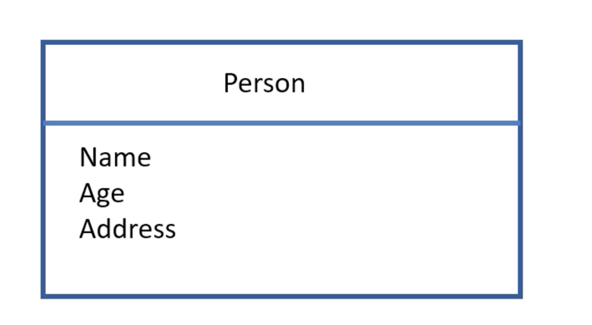

# Struct

* 구조체는 편리한 액세스 및 조작을 위해 명명된 멤버 필드를 사용하여 다양한 데이터 유형을 가진 관련 데이터 조각을 단일 단위로 구성하고 캡슐화할 수 있는 사용자 정의 데이터 유형입니다

* 구조체를 정의함으로써 프로그래머는 프로그램 요구 사항에 맞는 사용자 정의 데이터 유형을 생성할 수 있습니다




Rust 에서 구조체 정의하기

```rust
struct Person {
    name: String,
    age: u32,
    address: String,
}
```


## Different types of structs in Rust

Rust에는 세 가지 주요 유형의 구조체가 있습니다

1. **Tuple struct**: Struct that has unnamed fields
2. **Named struct**: Struct that has named fields
3. **Unit Struct**: Struct that has no fields


### Named Struct

Rust 의 명명 규칙에 따르면 구조체 이름은 **UpperCamelCase**(PascalCase)에 있어야 합니다. **UpperCamelCase**는 이름에서 각 단어의 첫 글자를 대문자로 표시하고 단어 사이에 밑줄이 없음을 의미합니다
e.g.: SensorData, User, CustomerDB

구조체의 멤버 요소(필드) 이름은 **snake_case**에 있어야 합니다. snake_case는 이름의 단어가 밑줄로 구분되고 모든 문자가 소문자임을 의미합니다
e.g.: address_curr, address_perm

```rust
//Defining a struct
struct Person {
    name: String,
    age: u32,
    address: String,
}

fn main() {
    //creating an instance of the 'struct Person'
    let person = Person {
        name: String::from("Alice"),
        age: 25,
        address: String::from("123 Main St"),
    };

    //도트(.) 연산자를 사용하여 각 멤버 요소의 값을 인쇄합니다
    println!("Name: {}", person.name);
    println!("Age: {}", person.age);
    println!("Address: {}", person.address);
}
```