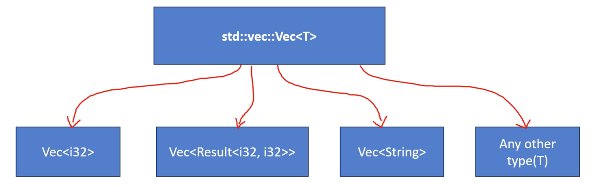

# Vectors

```rust
fn main() {
    // Define an array of integers with size 5
    let mut numbers: [i32; 5] = [1, 2, 3, 4, 5];

    // Print the array
    println!("Original array: {:?}", numbers);

    // Modify an element of the array
    numbers[2] = 99;

    // Print the modified array
    println!("Modified array: {:?}", numbers);

    // Print the length of the array
    print!("Length of the array: {}", numbers.len());

    // Iterating over the array and print each element
    for num in &numbers {
        println!("{}", num);
    }
}
```

- 요소를 메모리에 연속적으로 저장하는 확장 가능한 목록 유형입니다
- 벡터는 런타임 시 확장 및 축소가 가능합니다. 즉, 런타임 시 요소를 추가하거나 제거하여 크기를 수정할 수 있습니다  
  (Rust의 배열(`[T; N]`)은 컴파일 타임에 결정되는 고정된 크기를 가지고 있다는 것을 기억하시나요?)
- random access, push, pop 및 기타 목록과 유사한 작업을 지원합니다


## Vector in standard library

벡터는 `std::vec` 모듈에 정의되어 있습니다  
벡터의 기본 구조체는 `std::vec::Vec<T>`입니다  
여기서 `T`는 벡터에 포함된 요소의 유형입니다

- `Vec<i32>`
- `Vec<f32>`
- `Vec<String>`
- `Vec<Option<i32>>`

벡터는 `std` 크레이트의 일반 구조로 구현됩니다



벡터의 모든 요소가 동일한 유형인 한 벡터를 사용하여 모든 유형의 요소를 보유할 수 있습니다


## Important methods to be used with Vec

벡터 생성 및 초기화


```rust
fn main() {
    // Create an empty vector of i32 type
    let mut v = Vec::new();

    // Push elements into the vector
    v.push(1);
    v.push(2);
    v.push(3);
    v.push(4);
    v.push(5);

    // Iterate over the vector and print each element
    for i in v {
        println!("{}", i);
    }
}
```
↓ ↓ ↓ ↓ ↓ ↓

```rust
fn main() {
    // Rust의 `vec!` 구문은 벡터를 쉽게 생성하고 초기화할 수 있게 해주는 매크로입니다
    let v = vec![1, 2, 3, 4, 5];

    // Iterate over the vector and print each element
    for i in v {
        println!("{}", i);
    }
}
```
