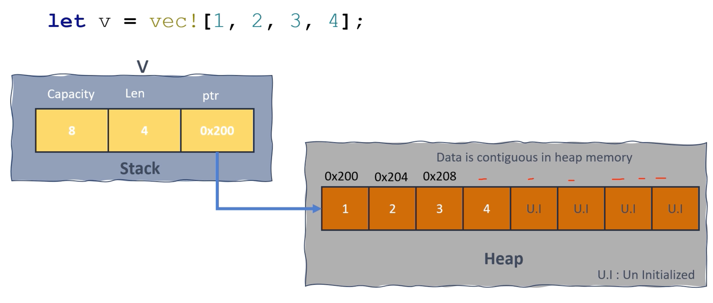

## Vector under the hood

### Method : `Vec::with_capacity();`

**When to use:**

벡터가 보유할 요소 수에 대한 추정 또는 지식이 있는 경우 이는 메모리 재할당을 최소화하면 눈에 띄는 차이를 만들 수 있는 성능이 중요한 코드 섹션에서 특히 유용할 수 있습니다

`let mut v = Vec::with_capacity(10);`