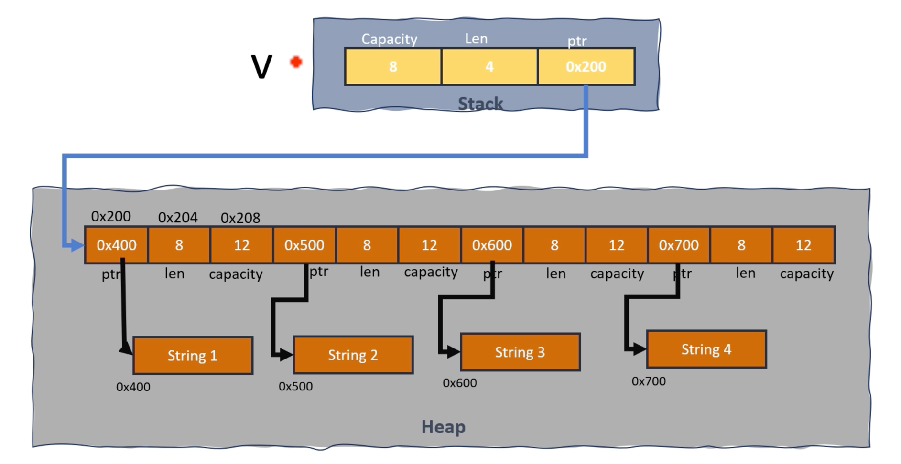

## Vec of Strings memory layout



## Vector indexing

```rust
fn main() {
    let v = vec![1, 2, 3];
    
    println!("{}", v[0]);
    // 런타임 시 '범위를 벗어난 인덱스' 오류로 인해 패닉이 발생합니다
    println!("{}", v[5]);
}
```

## Safe to vector indexing

`get()`과 `get_mut()` 모두 참조를 반환하지만 변경 가능성이 다릅니다

1. `get()`: 불변 참조(`Option<&T>`)를 반환합니다
2. `get_mut()`: 변경 가능한 참조(`Option<&mut T>`)를 반환합니다

```rust
fn main() {
    let mut vec = vec![1, 2, 3];

    // Using get
    // val_ref is of type Option<&i32>
    let val_ref = vec.get(1);
    if let Some(val) = val_ref {
        println!("Value: {}", val);
    }

    // Using get_mut
    // val_mut_ref is of type Option<&mut i32>
    let val_mut_ref = vec.get_mut(2);
    if let Some(val) = val_mut_ref {
        // 현재 위치의 값 역참조 및 수정
        *val *= 10;
    }
    println!("{:?}", vec);
}
```

Vec의 요소에 액세스하는 가장 안전한 방법은 `get` 및 `get_mut` 메소드를 사용하는 것입니다  
당황하는 대신 `Option<&T>` 또는 `Option<&mut T>`를 각각 반환합니다  
범위를 벗어난 인덱스에 직면했을 때