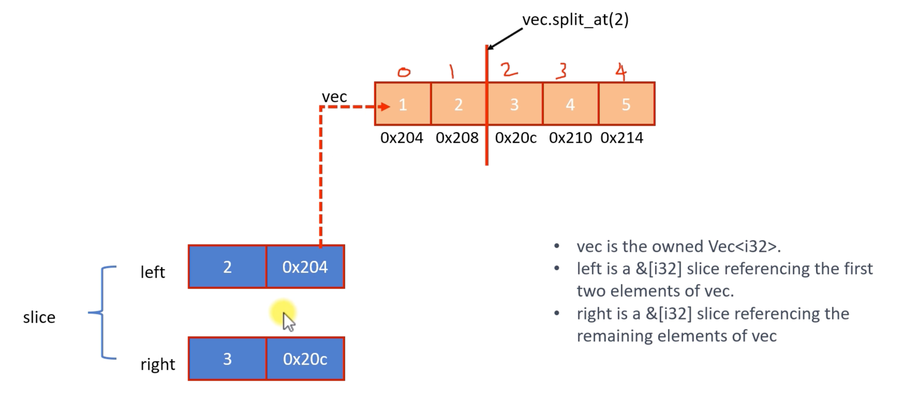

## Methods related to split

다양한 방법으로 벡터 분할하기

`split_at()`, `split_at_mut()`, `split()`, `rsplit()`, `splitn()`, `rsplitn()`

### split_at()

하나의 슬라이스를 인덱스에서 두 개로 나눕니다

https://doc.rust-lang.org/core/primitive.slice.html#method.split_at
https://doc.rust-lang.org/core/primitive.slice.html#method.split_at_mut





### split()

`split` 메소드는 조건자와 일치하는 요소로 구분된 하위 슬라이스에 대한 반복자를 만듭니다  
주어진 조건에 따라 슬라이스를 토큰화하거나 나누는 방법입니다

**참고:** 일치하는 요소는 하위 슬라이스에 포함되지 않습니다

https://doc.rust-lang.org/core/primitive.slice.html#method.split

`let vec = vec![1, 2, 3, 7, 11, 4, 33, 67, 8, 10];`

조건: 요소가 짝수인 경우 분할

`[1], 2, [3, 7, 11], 4, [33, 67], 8, 10`

```rust
fn main() {
    let vec = vec![1, 2, 3, 7, 11, 4, 33, 67, 8, 10];
    let subslices = vec.split(|e| e % 2 == 0);
    for slice in subslices {
        println!("{:?}", slice);
    }
}
```

클로저가 요소에 대해 `true`를 반환할 때마다 해당 요소는 분할 지점으로 처리되고 원래 조각은 해당 지점에서 분할됩니다(요소 자체는 제외)

### rsplit()

- `split`과 매우 유사하지만 차이점이 있습니다. `split`은 슬라이스의 처음부터 끝까지 반복하는 반면, `split`은 끝에서 처음까지 반복합니다
- 이는 조건자를 기반으로 시퀀스를 분할하고 싶지만 요소를 역순으로 작업하려는 경우에 유용할 수 있습니다

https://doc.rust-lang.org/core/primitive.slice.html#method.rsplitn


### split_off()

특정 인덱스에서 `Vec`을 두 부분으로 나누고 나중에 두 부분을 독립적으로 사용하려는 경우

```rust
fn main() {
    let mut vec = vec![1, 2, 3, 4, 5];

    // 벡터 형식 인덱스 3(0 기반)을 분할하여 요소 [4, 5]가 전송됩니다
    let split_vec = vec.split_off(3);

    println!("Original vector: {:?}", vec); // prints: [1, 2, 3]
    println!("Split-off vector: {:?}", split_vec); // prints: [4, 5]
}
```