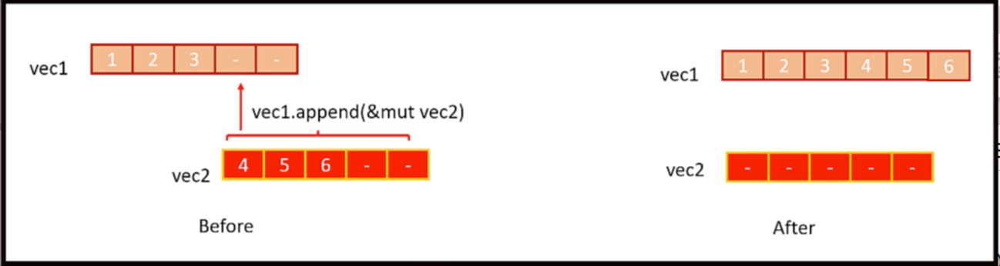

### splice()

`splice` 메서드는 벡터의 지정된 요소 범위를 반복자의 요소로 바꾸는 데 사용됩니다

```rust
fn main() {
    // 지난 10시간 동안의 기본 온도 판독값(섭씨)
    let mut primary_readings = vec![22.5, 23.0, 22.8, 0.0, 0.0, 0.0, 23.2, 22.9, 22.4, 22.0];

    // Backup readings for hours 4 to 6
    let backup_readings = vec![22.7, 22.6, 23.0];

    // `splice`는 반복자를 기대하기 때문에 컴파일되지 않습니다
    let faulty_readings: Vec<_> = primary_readings.splice(3..6, backup_readings).collect();

    println!("Corrected primary readings: {:?}", primary_readings);
    println!("Faulty readings: {:?}", faulty_readings);

}
```



## append() and extend()

### append()

한 벡터에서 모든 요소를 가져와 다른 벡터에 추가합니다. 이 작업 후에 소스 벡터는 비어 있습니다

**Note**:
추가 방법을 사용하면 vec2의 요소가 vec1로 이동되지만 vec2의 용량은 자동으로 줄어들지 않습니다  
따라서 vec2의 길이는 0이 되지만 용량은 변경되지 않습니다  
이는 현재 비어 있음에도 불구하고 vec2의 기본 메모리 할당이 그대로 유지됨을 의미합니다


### extend()

반복자를 가져와 해당 반복자의 요소로 벡터를 확장합니다

**Note**:
- `extend()`는 소스를 비우지 않습니다(벡터나 다른 컬렉션을 전달하는 경우)  
  항목을 소비하거나(반복자 소비의 경우) 항목을 복제/복사합니다(반복자 복제의 경우)