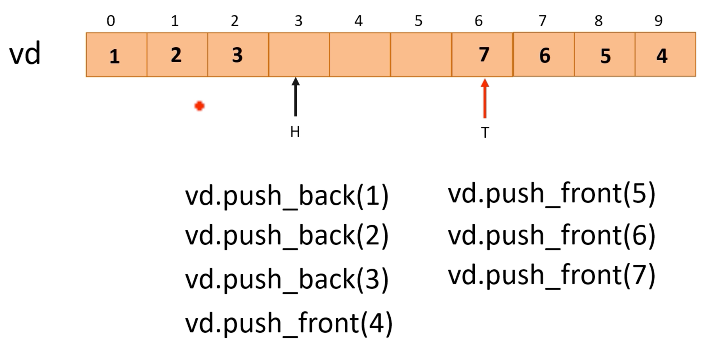

## VecDeque<T>

- **VecDeque**는 **Vector Deque**를 의미하며 **Deque**는 **Double-ended queue**를 의미합니다
- 확장 가능한 링 버퍼로 양방향 큐가 구현됩니다
- 양쪽 끝에서 요소를 효율적으로 푸시하고 팝할 수 있으므로 FIFO(선입선출) 대기열이 필요한 사용 사례에 특히 적합합니다

## VecDeque<T> vs Vec<T>

1. **설계**: `VecDeque`는 양방향 대기열로 설계되었습니다
2. **삽입 효율성**: `VecDeque`는 앞면과 뒷면 모두에서 효율적인 삽입을 지원하고, `Vec`은 뒷면에서 효율적인 삽입을 지원합니다
3. **제거 효율성**: `VecDeque`는 앞면과 뒷면 모두에서 효율적인 제거를 지원하고, `Vec`은 뒷면에서 효율적인 제거를 지원합니다
4. **액세스 효율성**: `VecDeque`와 `Vec` 모두 직접 액세스/인덱싱에 대해 O(1) 복잡성을 제공합니다
5. **중간에 삽입/제거**: 둘 다 중간에 요소를 삽입하거나 제거하는 데 O(n) 복잡도를 갖습니다. 그러나 `VecDeque`는 이동해야 하는 요소가 더 적은 끝을 선택할 수 있기 때문에 작업이 끝에 가까울 경우 더 효율적일 수 있습니다