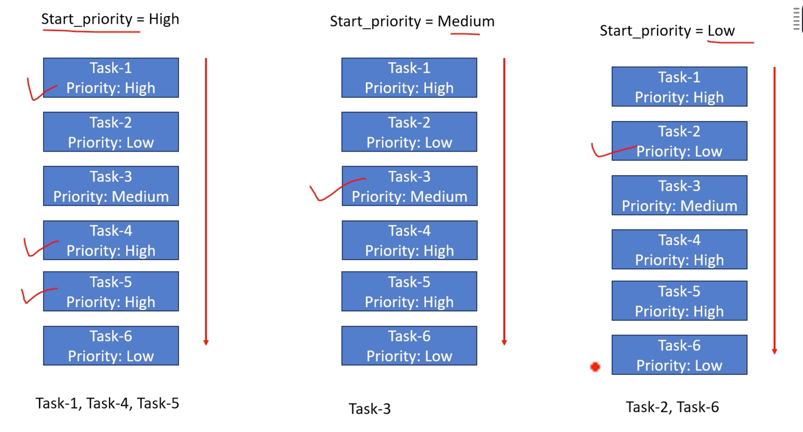

# Exercise: 우선 순위에 따라 작업을 인쇄하는 사용자 정의 `Iterator`

- 각 작업에 우선순위 `level(High, Medium, or Low)`이 할당된 할 일 목록을 관리하기 위한 Rust 프로그램을 만듭니다.  
  `Priority enum`, `Task struct` 및 사용자 정의 반복기 `PriorityIterator`가 포함된 제공된 Rust 코드를 활용하세요.  
  당신의 과제는 `PriorityIterator`를 사용하여 높은 것부터 시작하여 낮은 것까지 우선 순위에 따라 작업 목록을 반복하는 것입니다.
- 각각 다른 우선순위 수준을 가진 다양한 작업을 목록에 추가하세요.  
  반복자는 우선순위에 따라 작업을 순차적으로 반환하여 반복자에 캡슐화된 사용자 지정 정렬 논리를 보여주어야 합니다.  
  프로그램 출력에는 반복자가 반환한 순서대로 작업이 명확하게 표시되어 작업의 우선 순위를 보여주어야 합니다.

## Hints

1. 반복자가 생성되면 `current_priority`가 가장 높은 우선순위(`Priority::High`)부터 시작하도록 설정됩니다.
2. `next` 메소드가 호출될 때마다 반복자는 남은 작업을 통해 `current_priority`와 일치하는 작업을 찾습니다.
3. 현재 우선순위의 작업이 발견되면 반환되고 반복자 상태가 업데이트됩니다.
4. 현재 우선순위를 가진 작업이 더 이상 발견되지 않으면 반복자는 `current_priority`를 다음 낮은 우선순위(`High`에서 `Medium`으로 또는 `Medium`에서 `Low`로)로 업데이트하고 다음을 사용하여 작업을 찾기 시작합니다. 새로운 우선순위.
5. 이 프로세스는 모든 우선순위 수준의 작업이 산출되거나 반복자가 소진될 때까지 계속됩니다.

